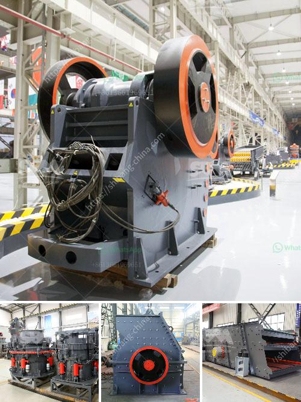

<h3>ball mill grinding</h3>
Ball mill grinding is a method that reduces the product into a controlled final grind and a uniform size, usually, the manganese, iron, steel balls or ceramic are used in the collision container. The ball milling process prepared by rod mill, sag mill (autogenous / semi autogenous grinding mill), jaw crusher, cone crusher, and other single or multistage crushing and screening.

With more than 35 years of experience in grinding balls mill technology, JXSC design and produce heavy-duty scientific ball mill with long life minimum maintenance among industrial use, laboratory use. Besides, portable ball mills are designed for the mobile mineral processing plant.

Despite of ball mills working strength, frequent maintenance of components such as hollow shaft, bearings and replacement of lubricant oil is a challenge. Innovation in ball mills with integration of drive systems by means of alternatives for variable speed solutions and fixed speed options provides customization to the user’s application. The inclusion of inching (variable speed) drives from ball mill manufacturers allows the rotation of the mill to slow down, enabling maintenance workers to safely replace the liners within the mill. This mode makes maintenance faster, easier and saves energy since it avoids restarting the mill several times.

Inching drives are notoriously “stuffed” and therefore infrequently used. However, they are necessary when the mill turns at a slower than normal rate and maintenance workers have to continuously monitor its slow turning, in case of centring of the mill or ballooning of the liner (as happens on some of the mill brands), even more frequent checks are necessary. The inching drive also known as a ‘reversing drive’, puts a brake on the mill shell as it rotates. These brakes are specifically designed to give an optimal braking force to each liner, regardless of its positioning.

By using the correct oil for the application, operators can extend the lubrication cycles out to several years as long as the oil is well sealed and not excessively exposed to blistering heat levels.

In designing for the future, guidelines for a more physically secure/safe and toxicologically less hazardous to install and maintain lubrication system should always be considered. The handling of heavy loads and the associated risks, in particular in the case of ball mills, are more acute than in the case of other plants whose dimensions are more modest. Combining these factors with industrial engineering expertise only results in more component knowledge, more experience in servicing ball mills, and a significant increase in mill availability.
<h3>Contact us</h3><ul><li><strong>Whatsapp:&nbsp;<a href="https://wa.me/8613661969651">+8613661969651</a></strong></li><li><a href="https://swt.shibang-china.com/?git&amp;zhl&amp;ball mill grinding"><strong>Online Service(chat now)</strong></a></li></ul><h3>Related</h3><ul><li><a href='used mobile stone crushers for sale.md'>used mobile stone crushers for sale</a></li><li><a href='cocoa processing plant in nigeria.md'>cocoa processing plant in nigeria</a></li><li><a href='mobile crusher indonesia hire mines crusher for sale.md'>mobile crusher indonesia hire mines crusher for sale</a></li><li><a href='equipment needed for small scale mining in zimbabwe.md'>equipment needed for small scale mining in zimbabwe</a></li><li><a href='20 ton peru mobile crushing plant.md'>20 ton peru mobile crushing plant</a></li></ul>