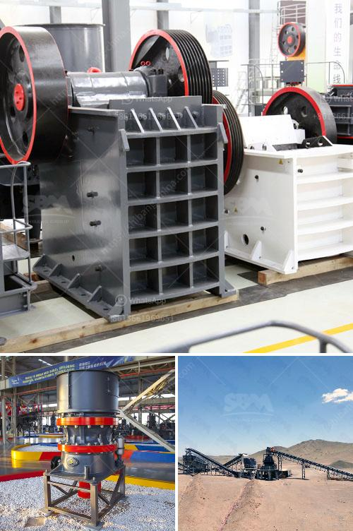

<h3>ball mill in peru</h3>
Peru is abundant in natural resources, and it has the 13th largest economy in the world by GDP. One of its most valuable resources is copper, and the country is currently among the top producers of this metal globally. To extract and process copper ore efficiently, a ball mill is essential. This article discusses the ball mill's role in the copper mining process in Peru.

Copper extraction and processing involve several stages. First, the ore containing copper is mined from open pits or underground mines. The ore is then crushed into smaller pieces using crushers or grinders. Ball mills are the most commonly used equipment for grinding materials during this stage.

A ball mill is a cylindrical machine that rotates around its axis. It is partially filled with metallic or ceramic balls, which grind material to the necessary fineness by friction and impact. The central role of the ball mill in the copper mining process in Peru is to reduce the material size, and prepare it for the subsequent mineral enrichment stage.

The ore exiting the ball mill is sent to the next step in the process, called flotation. The first stage of this process involves the removal of certain minerals from the ore, known as gangue, through a process called froth flotation. This step requires the material to be ground to a fine powder, which is facilitated by the ball mill's grinding action.

During froth flotation, chemicals are added to the ground ore, causing certain minerals to float to the surface. These minerals, containing the valuable copper, are then collected and further processed. The remaining material, known as tailings, is discarded. The efficiency of the flotation process largely depends on the proper grinding of the ore in the ball mill.

The ball mill's efficiency and throughput can be optimized by controlling the speed, filling level, and ball size. Additionally, understanding the properties of the ore and the grinding media can significantly improve the performance of the ball mill. Monitoring these parameters and making the necessary adjustments increases productivity and reduces energy consumption.

Moreover, ball mills are not only used in the copper mining industry but also in gold mining, iron ore processing, and other industries. Mining companies in Peru rely on ball mills to grind down the ore to the desired fineness for further processing. Equipment availability and maintenance are crucial factors in ensuring peak performance.

To sum up, Peru's abundant natural resources, such as copper, make the country an important player in the mining industry. Ball mills play a critical role in copper ore processing, helping to reduce the material size before further mineral enrichment. By optimizing the grinding process, efficiency and productivity can be improved, leading to enhanced economic outcomes for mining companies and the country as a whole.
<h3>Contact us</h3><ul><li><strong>Whatsapp:&nbsp;<a href="https://wa.me/8613661969651">+8613661969651</a></strong></li><li><a href="https://swt.shibang-china.com/?git&amp;zhl&amp;ball mill in peru"><strong>Online Service(chat now)</strong></a></li></ul><h3>Related</h3><ul><li><a href='stone crusher quarry.md'>stone crusher quarry</a></li><li><a href='gypsum powder ball mill machinery.md'>gypsum powder ball mill machinery</a></li><li><a href='industrial hammer mill malaysia.md'>industrial hammer mill malaysia</a></li><li><a href='small profile format for crusher company.md'>small profile format for crusher company</a></li><li><a href='ball mill machine in nigeria.md'>ball mill machine in nigeria</a></li></ul>