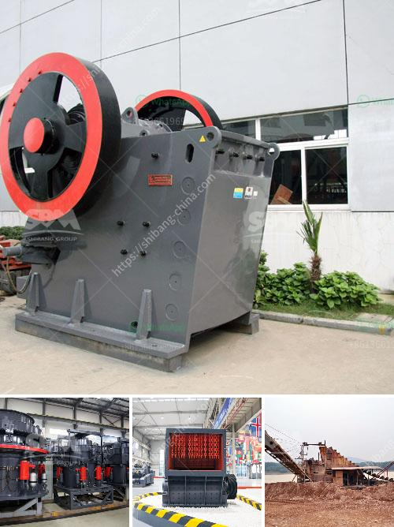

<h3>ball mill iron ore only company</h3>
Ball mill iron ore company, located in the heart of iron ore-rich regions, has been working diligently to extract and process the nation's crude iron ore deposits. These iron ore deposits, prized for their purity and high ferrous content, are crucial for the production of steel, which is an essential material in various industries. With exclusive mining rights and a commitment to sustainable practices, the company has emerged as a leader in the iron ore mining industry.

One of the main advantages that sets Ball Mill Iron Ore apart from its competitors is its exclusive mining rights. The company holds licenses that grant it sole access to extensive iron ore deposits in the region. This exclusivity ensures a consistent supply of high-grade iron ore, eliminating the need to rely on external sources.

Ball Mill Iron Ore operates state-of-the-art processing facilities that employ advanced technology to extract iron ore from the raw material. The company's modern ball mills use highly advanced grinding mechanisms to crush and grind the iron ore, resulting in high-quality iron ore concentrate.

The company maintains rigorous quality control measures throughout the entire extraction and processing process. Every batch of the extracted iron ore undergoes comprehensive laboratory testing to ensure it meets the required standards. By maintaining strict quality control, Ball Mill Iron Ore ensures that its products remain consistent and reliable for its customers.

Ball Mill Iron Ore values sustainable mining practices and is fully committed to protecting the environment and supporting local communities. The company implements environmentally friendly techniques during its mining operations to minimize its ecological footprint. Additionally, Ball Mill Iron Ore actively contributes to community development projects, improving the lives of the residents in the surrounding areas.

The operation of Ball Mill Iron Ore has a substantial positive impact on the local economy. The production of iron ore and subsequent usage in steel production creates employment opportunities for skilled workers, suppliers, and transportation services. The company's presence helps stimulate local businesses and indirectly contributes to the economic growth of the entire region.

As the sole company with exclusive mining rights, Ball Mill Iron Ore plays a pivotal role in the iron ore mining industry. Its state-of-the-art processing facilities, commitment to sustainability, and stringent quality control measures have cemented its position as a trusted supplier of high-grade iron ore. By optimizing its mining operations and supporting local communities, this company not only meets the growing demand for iron ore but also contributes to the economic growth of the region.
<h3>Contact us</h3><ul><li><strong>Whatsapp:&nbsp;<a href="https://wa.me/8613661969651">+8613661969651</a></strong></li><li><a href="https://swt.shibang-china.com/?git&amp;zhl&amp;ball mill iron ore only company"><strong>Online Service(chat now)</strong></a></li></ul><h3>Related</h3><ul><li><a href='calculate output of aggregate crushing plant.md'>calculate output of aggregate crushing plant</a></li><li><a href='manufacturing of marble and granite crusher machines.md'>manufacturing of marble and granite crusher machines</a></li><li><a href='cedar rapids crusher for sale.md'>cedar rapids crusher for sale</a></li><li><a href='barite grinding plants.md'>barite grinding plants</a></li><li><a href='impact crusher manufacturers in saudi.md'>impact crusher manufacturers in saudi</a></li></ul>