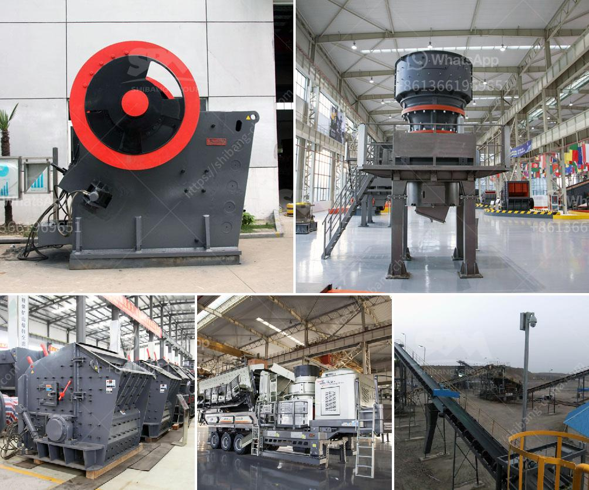

<h3>ball mill koppers</h3>
The ball mill is a key piece of equipment for grinding crushed materials, and it is widely used in production lines for powders such as cement, silicates, refractory material, fertilizer, glass ceramics, etc. as well as for ore dressing of both ferrous and non-ferrous metals.

Ball mills can grind wet or dry and can be continuous or batch type mills. Continuous mills have either a grate discharging or overflow discharge design. In a grate discharge mill, the material is discharged mechanically through a grated screen at the end. In an overflow discharge mill, the material is discharged by overflow through a perforated screen at the end.

One renowned manufacturer of ball mills is Koppers, which has been providing innovative solutions for grinding processes for over 100 years. Koppers ball mills are popular for their efficiency and reliability.

Koppers ball mills utilize high-quality materials and advanced technology to offer outstanding performance and durability. The mills are designed with various options, like slide shoe bearing or trunnion bearing, and they can be designed to optimize energy consumption while maintaining optimal production output.

Additionally, Koppers offers a range of accessories and services to support their ball mills, including spare parts, maintenance, and training programs. Their commitment to customer satisfaction has helped them establish a strong reputation in the industry.

In conclusion, Koppers ball mills are a reliable and efficient option for grinding materials in various industries. With their high-quality construction and innovative design, these mills ensure excellent performance and durability. Whether it is for grinding cement, silicates, or other materials, Koppers ball mills provide a cost-effective solution that guarantees optimal production output.
<h3>Contact us</h3><ul><li><strong>Whatsapp:&nbsp;<a href="https://wa.me/8613661969651">+8613661969651</a></strong></li><li><a href="https://swt.shibang-china.com/?git&amp;zhl&amp;ball mill koppers"><strong>Online Service(chat now)</strong></a></li></ul><h3>Related</h3><ul><li><a href='gold milling plant on small scale.md'>gold milling plant on small scale</a></li><li><a href='barite grinding plant machine sale.md'>barite grinding plant machine sale</a></li><li><a href='tonne per hour ball mill gold crushing.md'>tonne per hour ball mill gold crushing</a></li><li><a href='stone crusher price in india.md'>stone crusher price in india</a></li><li><a href='gypsum mines in pakistan.md'>gypsum mines in pakistan</a></li></ul>