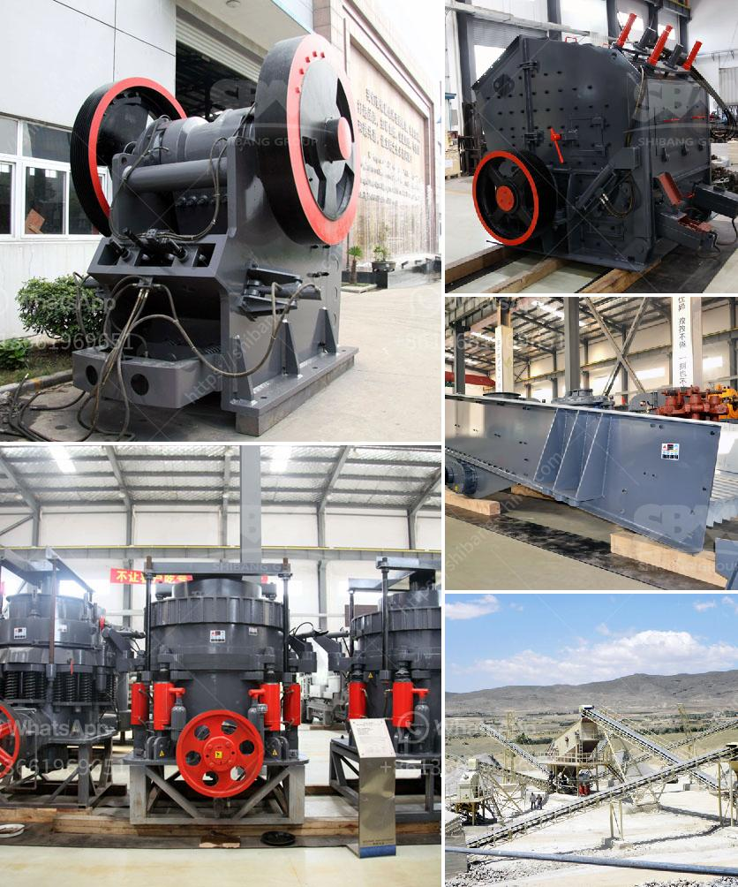

<h3>ball mill machine in nigeria</h3>
Ball mills are a type of grinder used to grind and blend materials for use in mineral dressing processes, paints, pyrotechnics, ceramics, and selective laser sintering. They are typically cylindrical in shape and rotate around a horizontal axis, partially filled with the material to be ground, plus the grinding medium.

Nigeria has abundant mineral resources, of which, about 100 million tons of talc reserves has been found in Nigeria, Peshawar region, Congo (Brazzaville) and Kaduna state. With the development of local economy, as well as the construction industry, talc is becoming more and more widely used. Talc powder is usually packaged and used as a surface coating material in various fields, such as plastics, rubber, ceramics, and so on. The expansion of talc applications also necessitates the improvement of talc grinding equipment.

Ball mill machine in Nigeria is widely used in building material, chemical industry, etc. There are two ways of grinding: the dry way and the wet way. It can be divided into tabular type and flowing type according to different extracting way of mine.

To improve the grinding efficiency of ball mill in Nigeria, several control strategies can be applied:

In the pre-grinding process, the ball mill machine in Nigeria is crushed to a certain particle size by the jaw crusher. This process is equivalent to a first-stage crushing operation, reducing the load of subsequent grinding operations and improving the grinding efficiency between the ball mill and the classifier.

The grinding technology is to use a ball mill to further pulverize the materials, and the operation efficiency of the equipment largely determines the quality of the powder. Therefore, the ball mill machine in Nigeria is widely employed in cement, silicate products, new building materials, refractory materials, fertilizer, black and non-ferrous metals beneficiation, and glass-ceramic production industries.

To ensure the uniformity of the material entering the ball mill machine in Nigeria, it is necessary to ensure that the materials are evenly distributed and spread on the whole surface of the ball mill drum. In this way, the grinding efficiency can be significantly improved.

Increasing the effective volume of the ball mill machine in Nigeria can reduce the occupied area, reduce energy consumption, and reduce the wear of grinding media and liners. With the increase in production capacity, the effective volume of the ball mill machine should be increased correspondingly, so as to maximize the grinding efficiency.

The moisture content of the materials fed into the ball mill machine in Nigeria has a great influence on the grinding efficiency. Generally speaking, the higher the moisture content of the materials, the lower the grinding efficiency. Therefore, the material moisture content should be strictly controlled.

In conclusion, the ball mill machine in Nigeria is vital for talc grinding and beneficiation in Nigeria. With the development of local economy, the demand for talc resources is increasing. The ball mill machine in Nigeria is suitable for processing talc and other materials, and plays an important role in the talc milling process.
<h3>Contact us</h3><ul><li><strong>Whatsapp:&nbsp;<a href="https://wa.me/8613661969651">+8613661969651</a></strong></li><li><a href="https://swt.shibang-china.com/?git&amp;zhl&amp;ball mill machine in nigeria"><strong>Online Service(chat now)</strong></a></li></ul><h3>Related</h3><ul><li><a href='stone crushing machines for brick making.md'>stone crushing machines for brick making</a></li><li><a href='rubber grinder machine in philippines.md'>rubber grinder machine in philippines</a></li><li><a href='gold ore milling machine.md'>gold ore milling machine</a></li><li><a href='staalmeester hammer mills.md'>staalmeester hammer mills</a></li><li><a href='crusher unit manufacturer india.md'>crusher unit manufacturer india</a></li></ul>