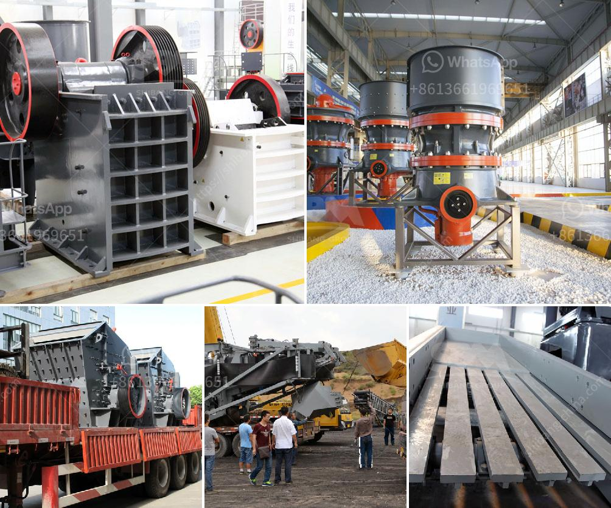

<h3>ball mill machine in pakistan</h3>
The industrial sector is undoubtedly a vital part of any country's economy. In Pakistan, cement production plays a significant role, contributing to the country's GDP and providing employment opportunities to thousands of individuals. One vital machine that is utilized in this production process is the ball mill machine.

The ball mill machine is a type of grinding equipment used to grind materials into extremely fine powder. It has various applications in the industrial sector, especially in cement production, metallurgy, chemicals, and ceramics. The ball mill machine consists of a cylindrical drum, which contains grinding media (e.g., balls) that rotate around their own axis, resulting in the grinding of the material fed into the machine.

In Pakistan, the ball mill machine is used to reduce the size of various materials, and the machine is widely used in industries such as cement, silicate products, new building materials, refractory materials, fertilizers, black and non-ferrous metal dressings, and glass ceramics, among others. It can grind materials of various hardness levels, dry or wet, and can be continuously operated or batch-operated. The ball mill machine provides high grinding efficiency, and it has resulted in increasing demand for this machine in the cement industry.

However, the ball mill machine in Pakistan has various errors and shortcomings. In the production process, there are many factors such as equipment quality, equipment installation, equipment maintenance, and equipment operation, among others, that will lead to various faults and problems and affect the smooth operation of the ball mill machine. Therefore, it is essential to conduct regular maintenance and repair work to ensure its optimal performance.

One common problem is the excessive wear of the liner plate inside the ball mill machine. The wear of the liner plate not only affects the production efficiency but also results in increased power consumption, lower output quality, and increased replacement costs. Therefore, it is crucial to regularly inspect and replace the liner plate to maintain the efficiency of the machine and ensure the stability of the production process.

Another common issue is the unbalanced grinding media distribution inside the ball mill machine. Improper distribution can lead to uneven grinding and reduce the overall efficiency. It is necessary to check the grinding media regularly and adjust the distribution if needed. Additionally, lubrication of the machine's moving parts is critical to prevent excessive friction and wear.

Furthermore, maintaining the proper temperature inside the ball mill machine is essential. Excessive heat can lead to equipment failure and damage. Regularly checking the temperature and ensuring proper cooling is crucial to prevent malfunctions.

In conclusion, the ball mill machine plays a significant role in the cement industry in Pakistan. As technology advances and more efficient models are introduced, it becomes imperative to focus on regular maintenance and repair to ensure the smooth operation of the machine. By addressing common issues such as liner plate wear, grinding media distribution, and temperature control, the ball mill machine can continue to contribute to the growth and success of the industrial sector in Pakistan.
<h3>Contact us</h3><ul><li><strong>Whatsapp:&nbsp;<a href="https://wa.me/8613661969651">+8613661969651</a></strong></li><li><a href="https://swt.shibang-china.com/?git&amp;zhl&amp;ball mill machine in pakistan"><strong>Online Service(chat now)</strong></a></li></ul><h3>Related</h3><ul><li><a href='limestone needed for 1 ton cement production.md'>limestone needed for 1 ton cement production</a></li><li><a href='clay beneficiation process.md'>clay beneficiation process</a></li><li><a href='cement factory plant cost.md'>cement factory plant cost</a></li><li><a href='cement mill plant design drawings.md'>cement mill plant design drawings</a></li><li><a href='crusher machine crusher machine.md'>crusher machine crusher machine</a></li></ul>