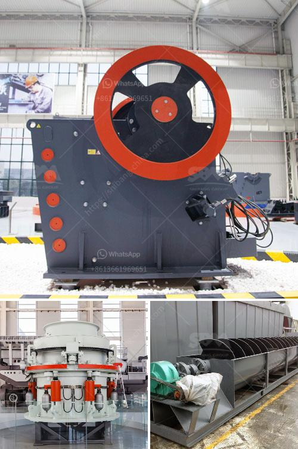

<h3>ball mill machine</h3>
The ball mill machine is an essential equipment for the processing industry, especially in mineral processing plants. It is widely used for the grinding of cement, silicate products, new building materials, fertilizers, and glass ceramics.

The ball mill machine consists of a cylindrical barrel, end caps, and a motor. The barrel is hollow and rotates on its axis. The end caps contain grinding media, which are balls made of steel, stainless steel, ceramic, or rubber. The rotation of the barrel causes the balls to cascade and grind the material into a fine powder.

One of the key advantages of the ball mill machine is its versatility. It can grind various types of materials, such as limestone, clay, minerals, and others. Additionally, it is capable of dry or wet grinding, which allows for simultaneous grinding and drying operations. This flexibility makes the ball mill machine suitable for both small-scale and large-scale production.

In terms of energy efficiency, the ball mill machine is known to have the highest efficiency level compared to other grinding machines. This is due to its low power consumption and low operating costs. The machine consumes less power because the grinding media and the material in the barrel are lifted and dropped by the rotation of the barrel, rather than relying on external forces. This results in lower energy consumption and cost savings.

Furthermore, the ball mill machine has a simple structure, which makes it easy to operate and maintain. It requires minimal supervision and can be easily integrated into existing production lines. The end caps of the machine are removable, allowing for easy cleaning and replacement of the grinding media. Regular maintenance ensures the smooth and efficient operation of the machine.

The ball mill machine also offers various benefits in terms of product quality. It ensures consistent and uniform particle size distribution, which is crucial for ensuring the quality and performance of the final product. The machine can produce fine powders with narrow particle size ranges, which are ideal for industries that require precise control of particle size.

Another advantage of using the ball mill machine is its ability to handle both dry and wet grinding processes. This allows for the processing of materials with different moisture levels, ensuring maximum efficiency and versatility. The machine can be adjusted to control the grinding process, making it suitable for wide-ranging applications.

In conclusion, the ball mill machine is a versatile and reliable machine that has been used in the processing industry for many years. Its high efficiency, low power consumption, and ease of operation and maintenance make it an ideal choice for various grinding applications. Whether it is used for cement, minerals, or other materials, the ball mill machine delivers consistent quality and optimal performance.
<h3>Contact us</h3><ul><li><strong>Whatsapp:&nbsp;<a href="https://wa.me/8613661969651">+8613661969651</a></strong></li><li><a href="https://swt.shibang-china.com/?git&amp;zhl&amp;ball mill machine"><strong>Online Service(chat now)</strong></a></li></ul><h3>Related</h3><ul><li><a href='mini concrete crushers.md'>mini concrete crushers</a></li><li><a href='rock crushing machine price in india.md'>rock crushing machine price in india</a></li><li><a href='jaw crusher in kenya.md'>jaw crusher in kenya</a></li><li><a href='rock belt conveyor spec.md'>rock belt conveyor spec</a></li><li><a href='ballast crushers cost.md'>ballast crushers cost</a></li></ul>