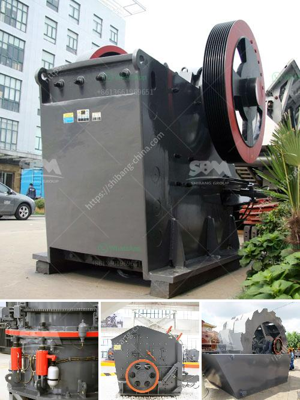

<h3>ball mill machinery supplier manufacturer</h3>
Ball mill is widely used in the powder production lines, such as cement, silicate, refractory materials, chemical fertilizer, glass ceramics, etc. According to the need of customers, ball mills can realize both wet and dry production. Ball mills have been designed in standard sizes of the final products between 0.074 mm and 0.4 mm in diameter.

Ball mill machinery supplier manufacturer is a key equipment for grinding materials, widely used in powder-making production line such as cement, silicate sand, new-type building material, refractory material, fertilizer, ore dressing of ferrous metal and non-ferrous metal, glass ceramics, etc. Ball mill can grind various ores and materials with dry type or wet type.

The ball mill is a cylindrical device used to grind (or mix) materials like ores, chemicals, ceramic raw materials, and paints. Ball mill rotate around a horizontal axis, partially filled with the material to be ground plus the grinding medium. Different materials are used as media, including ceramic balls, flint pebbles, and stainless steel balls. An internal cascading effect reduces the material to a fine powder.

The ball mill consists of a hollow cylindrical shell rotating about its axis. The axis of the shell may be either horizontal or at a small angle to the horizontal. It is partially filled with balls. The grinding media is the balls, which may be made of steel, stainless steel, ceramic, or rubber. The inner surface of the cylindrical shell is usually lined with an abrasion-resistant material such as manganese steel or rubber. Less wear takes place in rubber-lined mills.

Ball mills are classified as attritor, stirred ball mill, or tumbling ball mill, depending on the rotational speed, material to be ground, and the medium used. Ball mills are known for their simple operation, low maintenance, and consistent grinding performance.

When choosing a ball mill machinery supplier manufacturer, it is important to consider the reputation and experience of the supplier in manufacturing high-quality ball mills. The supplier should have a strong track record of delivering reliable and efficient ball mills to various industries.

Additionally, it is crucial to choose a supplier that offers a wide range of ball mill models, sizes, and configurations to suit different application requirements. This ensures that the customer can find a ball mill machinery that fits their specific needs and production capacity.

Furthermore, a reputable supplier should provide excellent after-sales service, including technical support, spare parts availability, and maintenance assistance. This ensures that the ball mill machinery continues to operate smoothly and efficiently during its lifespan.

In conclusion, a ball mill machinery supplier manufacturer plays a crucial role in providing high-quality ball mills for various industries. Therefore, it is important to choose a reputable supplier that offers a wide range of models and sizes, along with excellent after-sales service. With the right supplier, customers can rely on their ball mill machinery to deliver reliable and efficient performance for their production needs.
<h3>Contact us</h3><ul><li><strong>Whatsapp:&nbsp;<a href="https://wa.me/8613661969651">+8613661969651</a></strong></li><li><a href="https://swt.shibang-china.com/?git&amp;zhl&amp;ball mill machinery supplier manufacturer"><strong>Online Service(chat now)</strong></a></li></ul><h3>Related</h3><ul><li><a href='industrial gold mining equipment suppliers.md'>industrial gold mining equipment suppliers</a></li><li><a href='standard operating procedure for cement manufacturing.md'>standard operating procedure for cement manufacturing</a></li><li><a href='brand new stone crusher for sale in the philippines.md'>brand new stone crusher for sale in the philippines</a></li><li><a href='ball mill machine.md'>ball mill machine</a></li><li><a href='price of crushers of gravel.md'>price of crushers of gravel</a></li></ul>