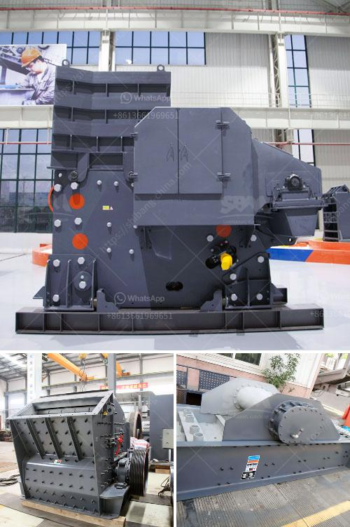

<h3>ball mill manufacturers coconut shell</h3>
Coconut shell, a by-product of the coconut industry, is harvested and utilized in various ways. One such utilization is as a raw material for the production of activated carbon, which is widely used in water purification, air filtration, and many other applications. To facilitate the production of high-quality activated carbon, ball mill manufacturers invest significant resources in the development and manufacturing of efficient and reliable coconut shell ball mills.

A ball mill is a type of grinder used to grind materials into fine powder. It is commonly used in the production of cement, silicate products, new building materials, fertilizers, and glass ceramics. A ball mill rotates around a horizontal axis, partially filled with the material to be ground plus the grinding medium. Different materials are used as media, including ceramic balls, flint pebbles, and stainless steel balls.

When it comes to processing coconut shell, ball mills are particularly advantageous due to their ability to grind the material into a fine powder. Coconut shells are naturally tough and require substantial force to reduce them to the desired particle size. With the use of ball mills, manufacturers can easily achieve the required fineness level. The rotating action of the mill and the sorting effect of the grinding media ensure efficient and uniform grinding, resulting in the desired particle size distribution.

In addition to grinding coconut shell, ball mills can also process other materials commonly used in the production of activated carbon. These include wood-based materials like sawdust and bamboo, as well as coal. However, coconut shell is highly preferred due to its high hardness, low ash content, and excellent adsorption properties.

Ball mill manufacturers specializing in coconut shell grinding provide efficient and reliable equipment for the production of high-quality activated carbon. This not only helps meet the growing demand for coconut shell activated carbon but also offers sustainable solutions to utilize coconut shells efficiently and reduce environmental waste. These manufacturers continuously innovate and improve their ball mills to meet the diverse needs of the industry, ensuring optimal performance, durability, and cost-effectiveness.

In conclusion, ball mill manufacturers play a vital role in the production of activated carbon from coconut shell. Their expertise and dedication in manufacturing high-quality and efficient ball mills contribute to the overall efficiency and sustainability of the coconut industry. With their help, coconut shell can be effectively transformed into a valuable resource, benefiting various industries and the environment.
<h3>Contact us</h3><ul><li><strong>Whatsapp:&nbsp;<a href="https://wa.me/8613661969651">+8613661969651</a></strong></li><li><a href="https://swt.shibang-china.com/?git&amp;zhl&amp;ball mill manufacturers coconut shell"><strong>Online Service(chat now)</strong></a></li></ul><h3>Related</h3><ul><li><a href='graphite powder processing equipment.md'>graphite powder processing equipment</a></li><li><a href='4 rolar raymond mill productions.md'>4 rolar raymond mill productions</a></li><li><a href='used carbon grinding production line.md'>used carbon grinding production line</a></li><li><a href='ball mill price list.md'>ball mill price list</a></li><li><a href='gypsum mines in pakistan.md'>gypsum mines in pakistan</a></li></ul>