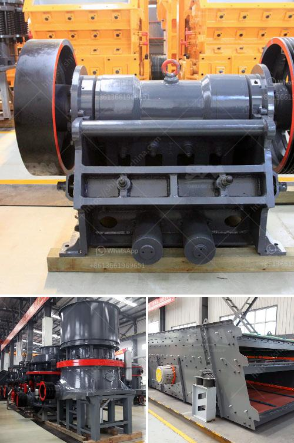

<h3>ball mill manufacturers in india for lime limestone</h3>
India is rich in mineral resources, with bountiful reserves of limestone. With its high calcium content, limestone has numerous industrial uses and is a vital raw material in many key industries around the world, especially in the construction, steel, and cement industries. In order to process high-quality limestone efficiently and maximize its utilization, it is essential to choose the right equipment. Ball mills are widely used as the key grinding machine in the process of lime limestone production.

The ball mill manufacturers in India are known for their high-performance equipment that is ideal for efficient grinding of lime limestone under harsh operating conditions. The equipment is robust and durable, ensuring minimal downtime, with consistent outcomes for the production process. The manufacturers invest in superior engineering and high-quality materials to ensure an excellent product that guarantees long-term performance.

One of the leading ball mill manufacturers in India, Techno Designs, offers its clients a wide range of machinery for the lime limestone grinding industry. The company's unique product range includes Ball Mills, Vertical Roller Mills, Attritors, and Bead Mills that are specifically designed for lime limestone grinding, ensuring consistent and reliable operation throughout the process. These machines are equipped with state-of-the-art technology and innovative features that allow for efficient grinding, reduced energy consumption, and high production capacity.

Techno Designs' ball mills are known for their exceptional performance and durability. They are constructed with high-quality materials and precision engineering to withstand the demands of the lime limestone grinding process. The equipment is designed to minimize maintenance costs and downtime, making it an ideal choice for manufacturers looking for a reliable and cost-effective solution.

In addition to Techno Designs, other renowned ball mill manufacturers in India include Promas Engineers, Chanderpur Group, and Laxmi Engineers. These companies are known for their expertise in the field of lime limestone grinding and their commitment to delivering high-quality equipment that meets industry standards. They offer customized solutions tailored to the specific requirements of their clients, ensuring maximum productivity and efficiency in the grinding process.

With the increasing demand for lime limestone in various industries, the ball mill manufacturers in India play a crucial role in the growth of the country's economy. They contribute to the development of the infrastructure sector by providing high-quality equipment that enhances the efficiency of lime limestone production. Moreover, these manufacturers focus on continuous innovation and research to stay ahead in the competitive market, offering advanced solutions and technologies for lime limestone grinding.

In conclusion, the ball mill manufacturers in India play a critical role in the lime limestone grinding industry. They provide high-quality equipment that ensures efficient grinding, reduced energy consumption, and maximum productivity. With their dedication to innovation and customer satisfaction, these manufacturers contribute significantly to the growth of the Indian economy and the development of various industries.
<h3>Contact us</h3><ul><li><strong>Whatsapp:&nbsp;<a href="https://wa.me/8613661969651">+8613661969651</a></strong></li><li><a href="https://swt.shibang-china.com/?git&amp;zhl&amp;ball mill manufacturers in india for lime limestone"><strong>Online Service(chat now)</strong></a></li></ul><h3>Related</h3><ul><li><a href='quarry stone crusherequipment.md'>quarry stone crusherequipment</a></li><li><a href='harga jaw crusher x.md'>harga jaw crusher x</a></li><li><a href='manufacturer of jaw crusher.md'>manufacturer of jaw crusher</a></li><li><a href='concrete crusher plant.md'>concrete crusher plant</a></li><li><a href='small portable crusher for laboratory purpose in india.md'>small portable crusher for laboratory purpose in india</a></li></ul>