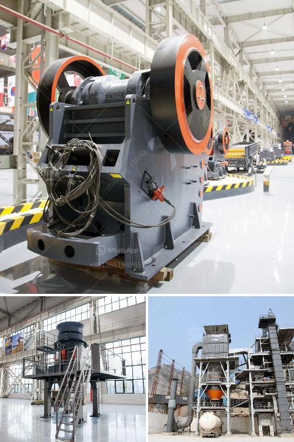

<h3>ball mill manufacturers in korea</h3>
Ball mills are essential pieces of equipment in many industries such as mining, chemical, and pharmaceutical sectors. These mills help to grind various materials into smaller sizes and produce desired particles for use in further processes. In South Korea, reputable ball mill manufacturers have been producing reliable and efficient products for many years to meet the demands of the market.

South Korea's ball mill manufacturers have embarked on the development of new and energy-saving products. Today, Korea has a strong industrial base and has indeed become one of the world's leading manufacturers of industrial machinery. Korean ball mill manufacturers have provided the necessary materials, components, and services to various industrial sectors, such as the chemical, pharmaceutical, and mining industries, thereby contributing to the growth and development of the national and global economy.

Quality and reliability are the key factors that distinguish Korean ball mill manufacturers. Korean manufacturers have adopted modern manufacturing techniques to produce high-quality ball mills that are capable of delivering exceptional performance. These ball mills are made using premium quality materials and cutting-edge technology to ensure their durability and long-lasting operation. Additionally, Korean manufacturers adhere to strict quality control measures, conducting rigorous inspections and tests to ensure that each ball mill meets the required standards before it is dispatched to the customers.

Korean manufacturers also focus on making their ball mills more energy-efficient. They understand the importance of reducing energy consumption for sustainable development. As a result, Korean ball mills are engineered to minimize energy loss during the grinding process, thereby optimizing efficiency and ultimately saving energy costs for their customers. These energy-efficient ball mills are designed with advanced features, such as high-speed rotation and improved grinding mechanisms, to achieve faster and more effective grinding results while utilizing less power.

Furthermore, Korean ball mill manufacturers are customer-oriented and provide excellent customer support services. They work closely with their clients to understand their specific requirements and provide tailor-made solutions. Korean manufacturers offer professional consultation, technical support, and after-sales services to ensure the best possible user experience. Whether it is providing guidance on installation, maintenance, or resolving any operational issues, Korean manufacturers are committed to providing comprehensive support to their customers.

In conclusion, Korean ball mill manufacturers have established themselves as reliable and competitive players in the global market. Their emphasis on producing high-quality, energy-efficient, and customer-oriented products has made them sought-after manufacturers in various industries. With their commitment to innovation and continuous improvement, Korean ball mill manufacturers are likely to make further advancements and contribute to the growth of the global industries they cater to.
<h3>Contact us</h3><ul><li><strong>Whatsapp:&nbsp;<a href="https://wa.me/8613661969651">+8613661969651</a></strong></li><li><a href="https://swt.shibang-china.com/?git&amp;zhl&amp;ball mill manufacturers in korea"><strong>Online Service(chat now)</strong></a></li></ul><h3>Related</h3><ul><li><a href='crushing machines in bolivia.md'>crushing machines in bolivia</a></li><li><a href='gold milling plant on small scale.md'>gold milling plant on small scale</a></li><li><a href='kaolin stone crusher.md'>kaolin stone crusher</a></li><li><a href='stone gravel crusher machine used for sale uae.md'>stone gravel crusher machine used for sale uae</a></li><li><a href='steel slag recycling plant.md'>steel slag recycling plant</a></li></ul>