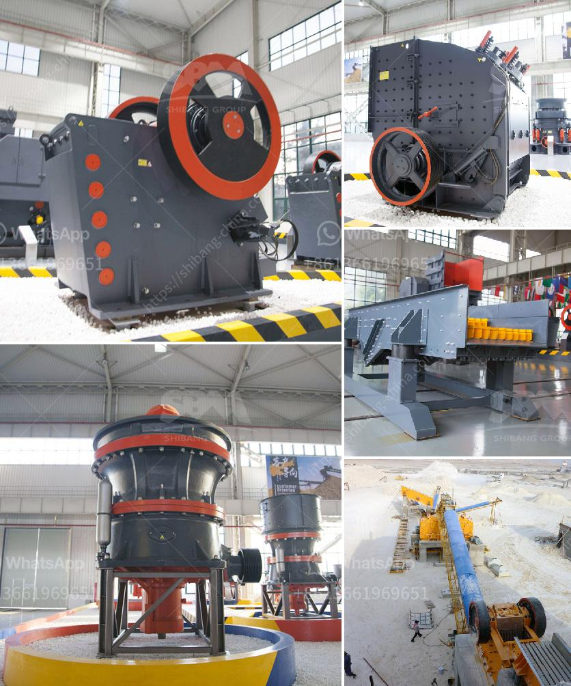

<h3>ball mill mesh size</h3>
The ball mill is a type of grinding machine used for reducing size of ore particles. It is designed to be a versatile grinding tool capable of performing various tasks, such as grinding, blending, and sometimes mixing materials. It has been widely used in industries, ranging from metallurgy and mining to cement, ceramics, and pharmaceuticals. One important parameter that determines the efficiency of this machine is the mesh size of the end product.

The mesh size of a ball mill determines the size of the product being discharged. For instance, smaller mesh sizes often result in finer and more uniform particles, while larger mesh sizes can have coarser particles with more variation in size. The choice of mesh size will depend on the required final product fineness and the characteristics of the material being ground.

In general, a finer mesh size is desirable when a higher degree of fineness is required. This is particularly important in industries such as pharmaceuticals and ceramics, where the end product needs to meet specific size specifications. For example, in the pharmaceutical industry, a certain mesh size may be required to ensure the optimal absorption and bioavailability of a drug in the human body. Similarly, in the ceramics industry, a finer mesh size can result in a smoother and more uniform surface finish.

On the other hand, a coarser mesh size may be preferred in some applications. For instance, in the mining industry, a larger mesh size may be used for ore grinding to achieve the desired liberation of valuable minerals from the gangue. In addition, a coarser mesh size can help reduce the wear on the grinding media and mill liners, thereby increasing the lifespan of the equipment.

It is worth noting that the mesh size of a ball mill can be adjusted by changing the size of the grinding media, number of grinding media, or the speed of the mill. However, this may also affect the grinding efficiency and the power consumption of the mill. Therefore, finding the optimal mesh size is a balance between achieving the desired product fineness and maintaining the efficiency of the grinding process.

In conclusion, the mesh size of a ball mill determines the size of the product being discharged and is an important parameter that affects the efficiency of the grinding process. It is crucial to select the appropriate mesh size based on the specific requirements of the industry and the characteristics of the material being ground. Whether a finer or coarser mesh size is preferred will depend on the desired final product fineness, wear considerations, and other factors. Therefore, careful consideration and experimentation may be necessary to determine the optimal mesh size for a given application.
<h3>Contact us</h3><ul><li><strong>Whatsapp:&nbsp;<a href="https://wa.me/8613661969651">+8613661969651</a></strong></li><li><a href="https://swt.shibang-china.com/?git&amp;zhl&amp;ball mill mesh size"><strong>Online Service(chat now)</strong></a></li></ul><h3>Related</h3><ul><li><a href='model of raymound roller mill.md'>model of raymound roller mill</a></li><li><a href='used cone crushers zambia.md'>used cone crushers zambia</a></li><li><a href='industrial mill crusher price.md'>industrial mill crusher price</a></li><li><a href='stone crusher mobile plant di indonesia.md'>stone crusher mobile plant di indonesia</a></li><li><a href='aggregate screens and crushers.md'>aggregate screens and crushers</a></li></ul>