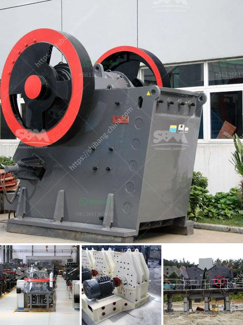

<h3>ball mill operating costs</h3>
Ball mill is the key equipment for grinding after the crushing process, which is widely used in the manufacture industries, such as cement, silicate, new building material, refractory material, fertilizer, ferrous metal, nonferrous metal and glass ceramics and can be used for the dry and wet grinding for all kinds of ores and other grind-able materials. 

The operating cost of a ball mill is directly affected by the efficiency of its operation. The energy consumption of a ball mill depends on the type of liners and grinding media installed, as well as the rotational speed of the mill. On average, a typical ball mill will consume around 15-20 kWh/tonne of material processed. 

The power consumption of a ball mill is influenced by factors such as grinding media shape, type of lining material, size and volume of the ball mill, rotation speed, and the quality of the grinding media. In general, the higher the efficiency of a ball mill, the lower the operating costs. Therefore, it is important to choose the right grinding media and liners for the mill to optimize grinding efficiency and reduce power consumption.

The type of grinding media used in a ball mill plays a significant role in determining the efficiency of the grinding process. Grinding media can be made of hardened steel, stainless steel, ceramic, or rubber. Hardened steel media is generally the most cost-effective option, but it may wear out quickly and cause contamination in certain applications. Stainless steel media is more expensive but offers superior corrosion resistance and longer lifespan. Ceramic media is highly efficient but expensive, while rubber media is commonly used for low-intensity grinding applications.

The lining material used in a ball mill also affects grinding efficiency and operating costs. Common lining materials for ball mills include rubber, steel, and ceramic. Rubber linings are cost-effective and have good wear resistance, but they may not withstand aggressive environments. Steel linings offer high resistance to impact and abrasion, but they can be prone to corrosion. Ceramic linings are extremely wear-resistant but may be expensive.

The size and volume of the ball mill also impact operating costs. A larger ball mill with a higher volume requires more grinding media and liner material, thus increasing the initial and ongoing operating costs. On the other hand, a smaller ball mill with a lower volume may not be able to process large quantities of material efficiently. Therefore, it is important to choose the optimal size and volume of the ball mill based on the specific requirements of the application.

In conclusion, the operating costs of a ball mill can be optimized by selecting the right grinding media and lining material, as well as the size and volume of the mill. By improving grinding efficiency and reducing power consumption, the overall operating costs can be minimized.
<h3>Contact us</h3><ul><li><strong>Whatsapp:&nbsp;<a href="https://wa.me/8613661969651">+8613661969651</a></strong></li><li><a href="https://swt.shibang-china.com/?git&amp;zhl&amp;ball mill operating costs"><strong>Online Service(chat now)</strong></a></li></ul><h3>Related</h3><ul><li><a href='how much is a crusher mincer in malaysia.md'>how much is a crusher mincer in malaysia</a></li><li><a href='used stone crushers for sale from uae.md'>used stone crushers for sale from uae</a></li><li><a href='clay grinder machine kerala.md'>clay grinder machine kerala</a></li><li><a href='components of a ball mill.md'>components of a ball mill</a></li><li><a href='tons per hour ball mill for sale in south africa.md'>tons per hour ball mill for sale in south africa</a></li></ul>