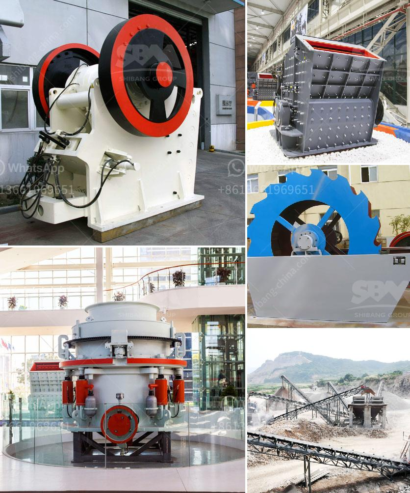

<h3>ball mill particle size in micrometets</h3>
In the field of mineral processing, the reduction of particle size plays a crucial role in the recovery and efficiency of the various materials being processed. Ball mills are widely used as a primary stage to produce the particulate material required for subsequent processing stages. The particle size of the produced material is often critical to the efficiency and quality of downstream operations.

A ball mill is a cylindrical machine generally used for mashing and crushing paints, ceramic materials, ores, and other hard materials. By rotating on horizontal axis, the ball mill effectively turns hard materials into fine particles. There are different ball mills on the market, but all of them use the same working principle and are consisted of the same elements. For example, grinding media (balls) and ceramic raw materials collide inside a cylinder, causing comminution, attrition, and abrasion of the particles.

The particle size distribution of the ground material obtained from a ball mill is determined by the these collision mechanisms. The more time the material spends inside the mill, the smaller the particle size will be. This is achieved by both the impact of the grinding media and the spatial distribution of the particles inside the mill.

Controlling the particle size in a ball mill is critical in achieving the desired size distribution and subsequent processing. Smaller particles require less energy to break down, leading to a more efficient grinding process. If the particle size is too large, or if the particles are agglomerated, the efficiency of the grinding operation decreases, resulting in increased energy consumption and lower quality end products.

Therefore, understanding and controlling the particle size in ball mills is crucial for efficient operation and obtaining desired product quality. Parameters such as mill speed, ball size, ball-to-powder ratio, and residence time can significantly affect the final particle size distribution. Hence, careful optimization of these parameters is necessary to achieve the desired particle size and achieving the desired product quality.

In conclusion, particle size control in ball mills is essential in mineral processing operations. By understanding the impact of various parameters on particle size distribution, operators can optimize grinding processes to achieve the desired particle size range for efficient downstream operations.
<h3>Contact us</h3><ul><li><strong>Whatsapp:&nbsp;<a href="https://wa.me/8613661969651">+8613661969651</a></strong></li><li><a href="https://swt.shibang-china.com/?git&amp;zhl&amp;ball mill particle size in micrometets"><strong>Online Service(chat now)</strong></a></li></ul><h3>Related</h3><ul><li><a href='how to setting up of stone crusher unit.md'>how to setting up of stone crusher unit</a></li><li><a href='gold refining plant italia setup.md'>gold refining plant italia setup</a></li><li><a href='company that work in crushing stones.md'>company that work in crushing stones</a></li><li><a href='mobile sand washing machine.md'>mobile sand washing machine</a></li><li><a href='functions of a mobile crushing plant.md'>functions of a mobile crushing plant</a></li></ul>