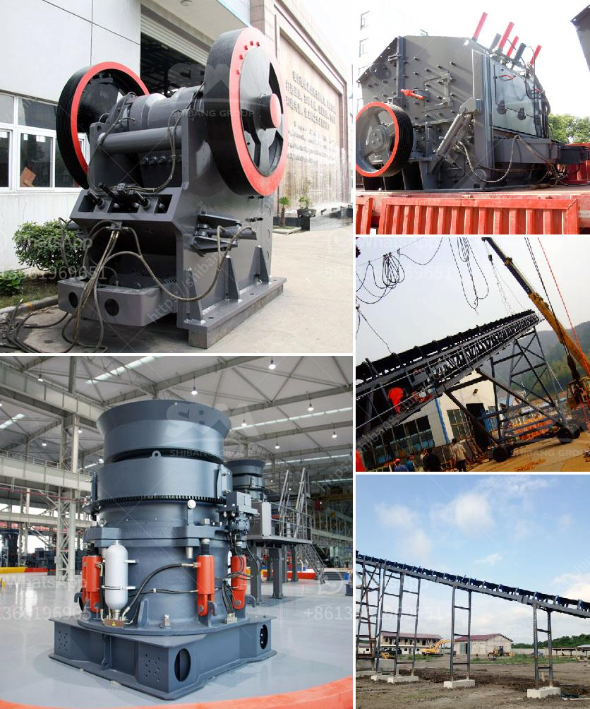

<h3>ball mill price list philippines</h3>
The ball mill is an essential grinding equipment for various kinds of minerals. It is widely used in the production lines of cement, silicate products, new building materials, refractory materials, fertilizers, black and non-ferrous metal beneficiation, and glass ceramics. Here, we will analyze its price list in Philippines.

First, let's take a look at the price analysis of the ball mill in Philippines. In order to help you buy a satisfactory product at a reasonable price, we have prepared a price comparison chart for the three commonly used ball mill machines, hoping to help you get the best price.

Based on continuous innovation and improvement, our ball mill has been developed into two series: EGNM wet ball mill and GURE dry ball mill. Each series serves different working conditions and needs.

1. EGNM wet ball mill: This type of ball mill is suitable for the Philippines’ wet grinding condition, achieving precise grinding and high grinding efficiency. According to the different materials, customers can choose different lining plates and grinding media to ensure the purity and whiteness of finished products. The price of EGNM wet ball mill ranges from ₱900,000 to ₱4,500,000.

2. GURE dry ball mill: This ball mill is suitable for the Philippines’ dry grinding condition. Its specialized structure and high grinding efficiency make it highly recognized by customers. The price of GURE dry ball mill ranges from ₱1,000,000 to ₱6,000,000.

Additionally, there are other factors that could affect the price of the ball mill in the Philippines. For example, the size and capacity of the ball mill can influence its price. Generally, larger ball mills have higher price tags due to their higher processing capacity and greater investment in technology. In addition, the material of the ball mill also affects its price. The ball mill made of high-quality materials will have a higher price. Moreover, the brand awareness and reputation of the manufacturer also play an important role in determining the price.

When purchasing a ball mill, customers should not only consider the price but also the after-sales service provided by the manufacturer. A reliable and professional manufacturer can provide customers with comprehensive technical support, on-site installation guidance, and regular maintenance services, ensuring the smooth operation of the equipment and prolonging its service life.

In conclusion, the ball mill price in the Philippines varies depending on the model and capacity, as well as other factors such as brand, material, and after-sales service. Customers should take various factors into consideration and make a reasonable choice based on their specific needs and budget. Choosing a reliable manufacturer is equally important to ensure the quality and performance of the ball mill.
<h3>Contact us</h3><ul><li><strong>Whatsapp:&nbsp;<a href="https://wa.me/8613661969651">+8613661969651</a></strong></li><li><a href="https://swt.shibang-china.com/?git&amp;zhl&amp;ball mill price list philippines"><strong>Online Service(chat now)</strong></a></li></ul><h3>Related</h3><ul><li><a href='mobile crusher on hire in tamil nadu.md'>mobile crusher on hire in tamil nadu</a></li><li><a href='ball mill manufacturers coconut shell.md'>ball mill manufacturers coconut shell</a></li><li><a href='used stone crusher in germany.md'>used stone crusher in germany</a></li><li><a href='bentonite grinding mill in italy crusher.md'>bentonite grinding mill in italy crusher</a></li><li><a href='barite processing plants in texas.md'>barite processing plants in texas</a></li></ul>