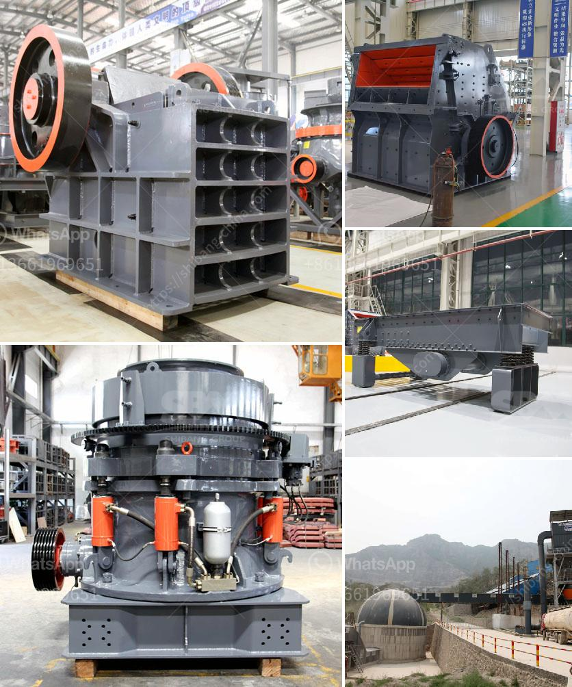

<h3>ball mill price list</h3>
Ball mill is the key equipment for grinding after the crushing process in the beneficiation plant, it is used to grind kinds of materials such as copper ore, gold ore, magnetite ore, quartz, lead zinc ore, feldspar and other materials into fine powder 20-75 micrometer. Based on discharging type, It could be grate type,overflow type etc.

The ball mill machine is an essential equipment for grinding various ores and other materials. It plays a vital role in the mineral processing industry due to its high efficiency, reliability, and low energy consumption. However, the price of the ball mill machine can vary depending on the model, capacity, and the quality of the machine.

As for the price list, the higher quality and larger capacity machines tend to have higher prices. In general, the price range starts from a few thousand dollars and can go up to several hundred thousand dollars. The price will also depend on the manufacturer and supplier of the machine.

When purchasing a ball mill machine, it is important to consider the specific requirements of the application and the budget of the buyer. Different industries may require different capacity and features of the machine. Therefore, it is advisable to consult with experienced professionals or manufacturers to determine the most suitable option.

In addition to the initial investment, it is also crucial to take into account the maintenance and operating costs of the machine. A machine with lower initial price but higher maintenance and operating costs may end up being more expensive in the long run.

To get an accurate price list, it is recommended to contact different manufacturers and suppliers and ask for quotations. It is also advisable to compare the prices, features, and reviews of different brands to make an informed decision.

In conclusion, the ball mill price list can vary depending on various factors such as capacity, model, and quality of the machine. It is crucial to consider the specific requirements of the application and budget constraints when purchasing a ball mill machine. Consulting with experienced professionals and comparing prices from different manufacturers can help in making a wise decision.
<h3>Contact us</h3><ul><li><strong>Whatsapp:&nbsp;<a href="https://wa.me/8613661969651">+8613661969651</a></strong></li><li><a href="https://swt.shibang-china.com/?git&amp;zhl&amp;ball mill price list"><strong>Online Service(chat now)</strong></a></li></ul><h3>Related</h3><ul><li><a href='rubble crushers for sale.md'>rubble crushers for sale</a></li><li><a href='barite processing plants in texas.md'>barite processing plants in texas</a></li><li><a href='screening and crushing solutions.md'>screening and crushing solutions</a></li><li><a href='clay crusher machine.md'>clay crusher machine</a></li><li><a href='stone crusher importer in ethiopia.md'>stone crusher importer in ethiopia</a></li></ul>