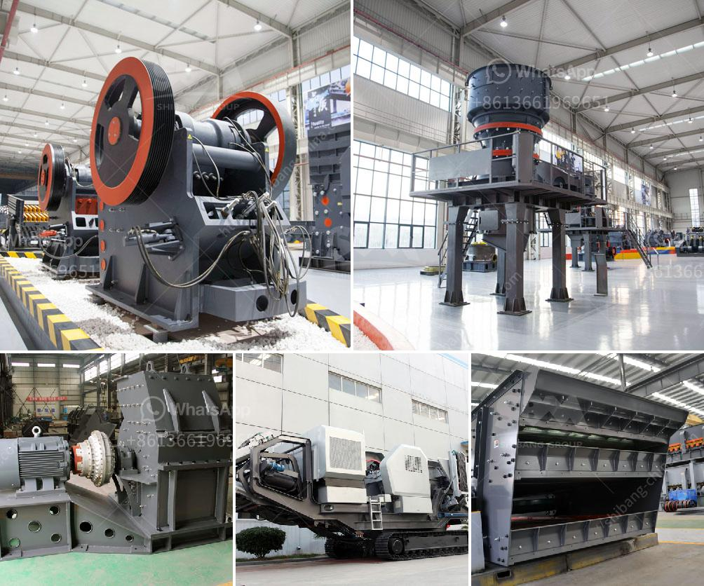

<h3>ball mill production capacity</h3>
Ball mill is a type of grinding machine used for grinding different materials, such as cement, ceramics, silicates and rocks. It is commonly used in mineral processing, building materials, chemical industry and other industries.

Ball mill production capacity is usually affected by factors such as the hardness, feed size, particle size, moisture content, grinding system, material properties, liner plate wear, grinding media consumption, feed rate, rotation speed, etc. So how to effectively improve the production capacity of ball mill is a crucial question for many enterprises.

Firstly, control the grindability index of raw materials. There are several ways to control the grindability index, such as controlling the particle size distribution of the grinding products, choosing the appropriate grinding equipment to reduce over-grinding and improve grinding efficiency, using a grinding aid or additive.

Secondly, control the feeding capacity. In order to improve the production capacity of the ball mill, the fluidity of the materials must be ensured. The suitable feeding capacity should be controlled within the effective range of the ball mill. Overfeeding or underfeeding will have a negative impact on the production efficiency and even cause blockage or strangulation, affecting the normal operation of the ball mill.

Thirdly, optimize the grinding system. The grinding system includes the grinding media, grinding efficiency, classifier, control system, material flow, etc. Ball mills are known for their simple, reliable and automated operation. However, as the size reduction process involves a complex mix of physical and chemical transformations, grinding efficiency is highly dependent on the mill configuration and operation.

Optimizing the grinding system involves adjusting the ball charge, grinding media ratio, feed rate, grinding time, etc. By optimizing these factors, the production capacity of the ball mill can be improved.

Fourthly, improve the wear resistance of liner plate. The wear resistance of liner plate directly affects the running efficiency and service life of the ball mill. The suitable liner plate should be chosen according to the physical properties of the grinding materials and the operating condition of the ball mill. Different types of liner plate can be selected to meet the different needs of production capacity improvement.

Fifthly, control the rotation speed. The rotation speed of the ball mill should be controlled within the specified range, which can effectively improve the grinding efficiency and ensure the normal operation of the ball mill. The rotation speed can be adjusted by adjusting the motor power or changing the speed limiting device.

In conclusion, improving the ball mill production capacity is crucial for enterprises to enhance the competitiveness of products and ultimately achieve sustainable development. Through optimizing various factors affecting the production capacity of the ball mill, such as grindability index, feeding capacity, grinding system, liner plate wear, and rotation speed, enterprises can effectively improve the production capacity and grinding efficiency of the ball mill, which will bring considerable economic benefits.
<h3>Contact us</h3><ul><li><strong>Whatsapp:&nbsp;<a href="https://wa.me/8613661969651">+8613661969651</a></strong></li><li><a href="https://swt.shibang-china.com/?git&amp;zhl&amp;ball mill production capacity"><strong>Online Service(chat now)</strong></a></li></ul><h3>Related</h3><ul><li><a href='chrome beneficiation plant china.md'>chrome beneficiation plant china</a></li><li><a href='barite bulking process.md'>barite bulking process</a></li><li><a href='for sale used mobile jaw crusher philippines.md'>for sale used mobile jaw crusher philippines</a></li><li><a href='stone crusher powder which products in use in philippines.md'>stone crusher powder which products in use in philippines</a></li><li><a href='small scale gold mining machine and their price.md'>small scale gold mining machine and their price</a></li></ul>