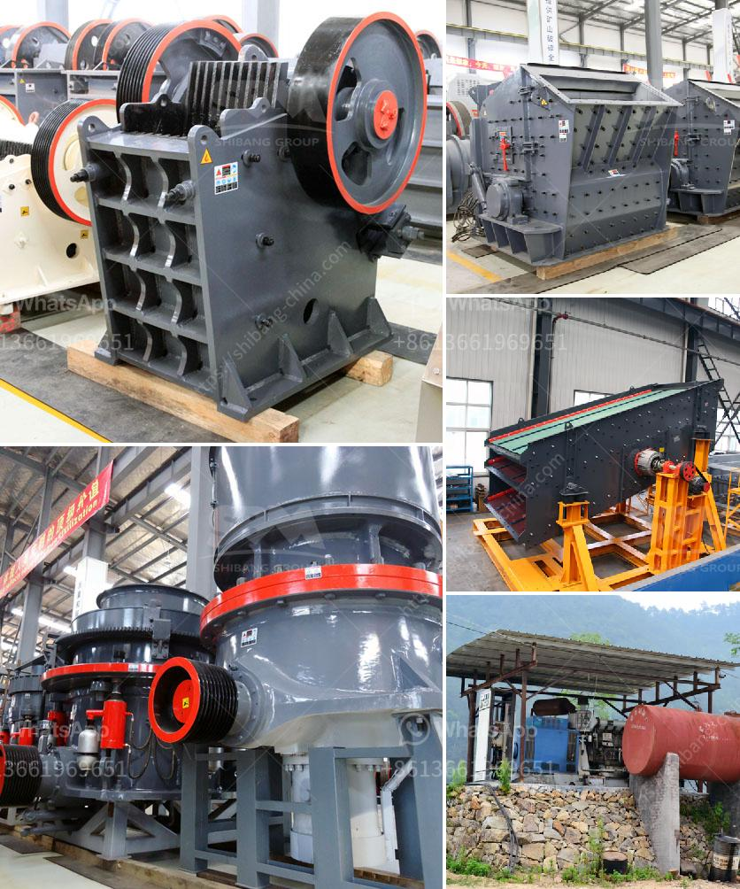

<h3>ball mill projects for slag in india</h3>
Ball mill projects for slag in India are gaining more and more attention by the government and various organizations due to their immense potential to help reduce greenhouse gas emissions. India has a huge amount of untapped slag potential, which is currently being discarded as waste. However, by using ball mills to convert slag into a valuable product, India can not only save valuable natural resources but also contribute significantly to the reduction of carbon emissions.

Ball mills are used to grind and homogenize various materials, such as cement, clinker, slag, and others. They can be used for both dry and wet grinding, making them highly versatile equipment. In the case of slag, ball mills can grind it into fine particles for use in various applications like cement production, road construction, and more.

One of the key advantages of using ball mill projects for slag in India is its ability to reduce the carbon footprint. Traditional cement production methods release a significant amount of carbon dioxide, a major greenhouse gas. However, when slag is ground and used as a substitute for a portion of the cement, it leads to a substantial reduction in carbon emissions.

Furthermore, ball mill projects for slag in India also offer economic benefits. The use of slag in construction projects can significantly lower construction costs, making it an affordable option for infrastructure development. Additionally, the production of slag-based cement can create job opportunities in the local communities, fostering economic growth.

To further promote ball mill projects for slag in India, the government and various organizations should provide incentives and support to encourage industries to adopt this eco-friendly approach. Funding schemes, tax benefits, and technical assistance are some of the measures that can be implemented to drive investment in this sector.

In conclusion, ball mill projects for slag in India have the potential to contribute to the country's sustainable development goals by reducing carbon emissions, conserving natural resources, and promoting economic growth. It is essential for the government and organizations to recognize the importance of this technology and take proactive steps to encourage its adoption. Through collaborative efforts, India can harness the full potential of slag, transforming it from waste to a valuable resource.
<h3>Contact us</h3><ul><li><strong>Whatsapp:&nbsp;<a href="https://wa.me/8613661969651">+8613661969651</a></strong></li><li><a href="https://swt.shibang-china.com/?git&amp;zhl&amp;ball mill projects for slag in india"><strong>Online Service(chat now)</strong></a></li></ul><h3>Related</h3><ul><li><a href='rent a conveyor belts singapur.md'>rent a conveyor belts singapur</a></li><li><a href='cameroon quarry crusher.md'>cameroon quarry crusher</a></li><li><a href='sand mining equipment malaysia.md'>sand mining equipment malaysia</a></li><li><a href='mini concrete crushers.md'>mini concrete crushers</a></li><li><a href='crusehr equipment ball mill.md'>crusehr equipment ball mill</a></li></ul>