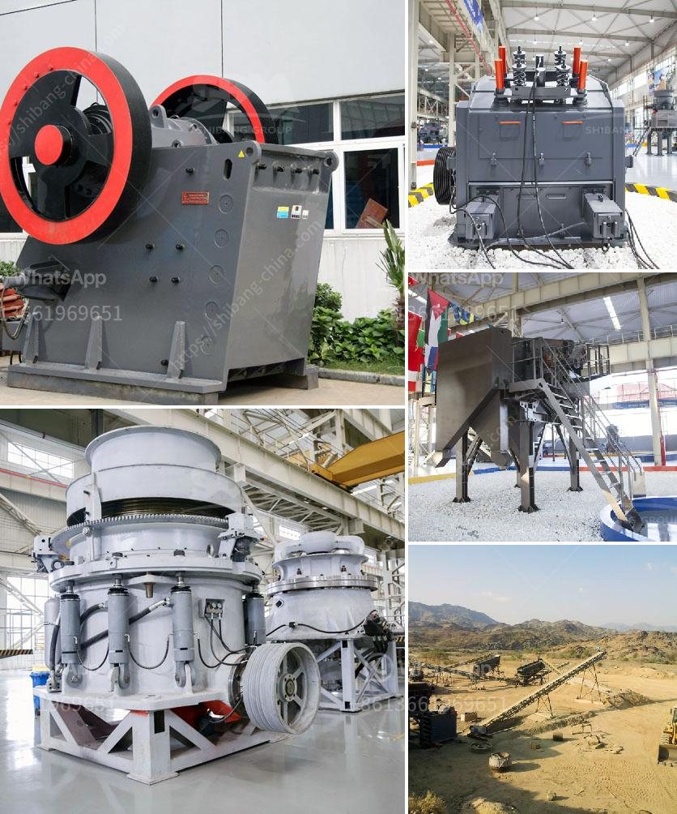

<h3>ball mill pulverizer price</h3>
The ball mill pulverizer is a vital tool for grinding many materials into fine powder. With the increasing demand for quality mineral processing equipment, the ball mill pulverizer market is expected to flourish in the near future. With the increasing number of technological advancements in the industry, the competitiveness of ball mill pulverizers is also increasing, thus increasing their price.

One of the main factors that contribute to the high price of ball mill pulverizers is the high cost of raw materials. The quality and durability of the raw materials used in the manufacturing process directly affect the final price of the equipment. High-quality materials ensure longer equipment life, better performance, and more efficient grinding, but they also come at a higher cost.

Additionally, the price of ball mill pulverizers is influenced by the size and efficiency of the machine. Larger machines with higher grinding capacities tend to cost more due to the complexity of their design and production. Similarly, high-efficiency machines require more advanced technology and precision manufacturing processes, which further drives up the price.

Another important factor influencing the price of ball mill pulverizers is market demand. When the demand is high, manufacturers may increase prices to maximize their profits. Conversely, when the demand is low, manufacturers may reduce prices to attract customers. Therefore, market dynamics can play a crucial role in determining the price of ball mill pulverizers.

Furthermore, the cost of labor and overhead expenses can also contribute to the price of ball mill pulverizers. Skilled labor is required to manufacture and assemble these complex machines. Moreover, overhead expenses such as rent, utilities, and maintenance costs add to the overall production cost, which in turn affects the product price.

The price of ball mill pulverizers can vary significantly depending on these factors. On average, a basic ball mill pulverizer can cost anywhere from $20,000 to $150,000. However, the price tag on high-quality ball mill pulverizers can range from $10,000 to $150,000, depending on the size, efficiency, and overall functionality.

Purchasing a ball mill pulverizer can be a significant investment for any company, especially for those who require a large-scale grinding solution. It is crucial to carefully consider the requirements and specific needs of the business before making a purchase. Evaluating factors such as production capacity, material type, and desired particle size will help determine the appropriate machine and its associated cost.

In conclusion, the price of ball mill pulverizers is determined by various factors, including the quality of raw materials, size, efficiency, market demand, labor costs, and overhead expenses. Businesses should thoroughly analyze their grinding requirements and consider these factors to make an informed decision about purchasing a ball mill pulverizer. By doing so, they can ensure they invest in a reliable, efficient, and cost-effective solution that meets their production needs.
<h3>Contact us</h3><ul><li><strong>Whatsapp:&nbsp;<a href="https://wa.me/8613661969651">+8613661969651</a></strong></li><li><a href="https://swt.shibang-china.com/?git&amp;zhl&amp;ball mill pulverizer price"><strong>Online Service(chat now)</strong></a></li></ul><h3>Related</h3><ul><li><a href='grinding mills ata.md'>grinding mills ata</a></li><li><a href='jual mesin limestone crusher.md'>jual mesin limestone crusher</a></li><li><a href='raymond mill roll asembley.md'>raymond mill roll asembley</a></li><li><a href='nigeria inpactor crushers price.md'>nigeria inpactor crushers price</a></li><li><a href='suppliers of conveyor belts in malaysia.md'>suppliers of conveyor belts in malaysia</a></li></ul>