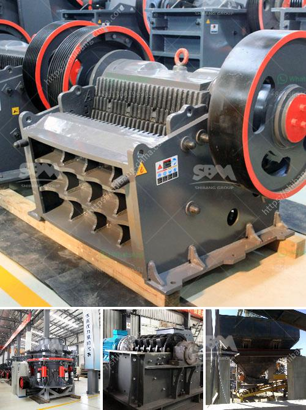

<h3>ball mill servicing agents south africa</h3>
Ball mills are used primary for single stage fine grinding, regrinding, and as the second stage in two-stage grinding circuits. According to the need of customers, ball mills can be either wet or dry designs. Ball mills have been designed in standard sizes of the final products between 0.074 mm and 0.4 mm in diameter.

As one of the leading ball mill manufacturers in South Africa, SBM offers different types of ball mill for sale with low price and high performance. In addition to the crushing equipment, SBM provides grinding equipment, belt conveyor and vibrating feeder for South Africa mining industry.

In South Africa, SBM's ball mill is widely used in mineral processing, building materials and chemical industry. According to different grinding requirements, the ball mill can be equipped with different specifications of the grinding medium, such as steel balls, iron rods or porcelain balls.

SBM's ball mill not only has high production capacity, but also has the advantages of low operating cost, wear resistance and easy maintenance. With more than 20 years of experience in ball mill servicing and maintenance, SBM has established its own servicing team in South Africa.

The servicing agents in South Africa are highly trained and experienced in the maintenance and repair of ball mills. They provide onsite services such as inspection, troubleshooting, and repairing any issues with the mill. They also offer routine maintenance services to keep the mill running smoothly and efficiently.

The ball mill servicing agents in South Africa also provide training for mill operators and maintenance personnel to ensure proper operation and maintenance of the mill. They are available 24/7 to assist with any emergencies or breakdowns, minimizing downtime and maximizing productivity.

In addition to servicing and maintenance, the agents also provide spare parts for ball mills. They have a wide range of high-quality spare parts in stock, ensuring quick and efficient replacement when needed. The agents work closely with the manufacturers to ensure that the spare parts supplied are of the highest quality and meet the specifications of the original equipment.

To further support their customers, the servicing agents in South Africa also offer technical consulting services. They provide expert advice and recommendations on optimizing the performance of the ball mill, improving production efficiency, and reducing operating costs.

With their extensive knowledge and experience, the ball mill servicing agents in South Africa play a crucial role in ensuring the smooth and efficient operation of ball mills in the mining industry. Their dedication to customer service and commitment to excellence make them the preferred choice for any ball mill servicing needs in South Africa.

In conclusion, ball mills are essential equipment in the mining industry, and proper maintenance and servicing are crucial for their optimal performance. The ball mill servicing agents in South Africa offer a comprehensive range of services, including inspection, troubleshooting, repair, and maintenance. With their expertise and dedication, they ensure the smooth operation of ball mills, maximizing productivity and reducing downtime.
<h3>Contact us</h3><ul><li><strong>Whatsapp:&nbsp;<a href="https://wa.me/8613661969651">+8613661969651</a></strong></li><li><a href="https://swt.shibang-china.com/?git&amp;zhl&amp;ball mill servicing agents south africa"><strong>Online Service(chat now)</strong></a></li></ul><h3>Related</h3><ul><li><a href='buy the stone crusher function of 1100.md'>buy the stone crusher function of 1100</a></li><li><a href='feldspar ball mill porcess.md'>feldspar ball mill porcess</a></li><li><a href='jaw crusher technical parameter.md'>jaw crusher technical parameter</a></li><li><a href='sayaji jaw crusher vadodara.md'>sayaji jaw crusher vadodara</a></li><li><a href='rock crusher machine manufacturer.md'>rock crusher machine manufacturer</a></li></ul>