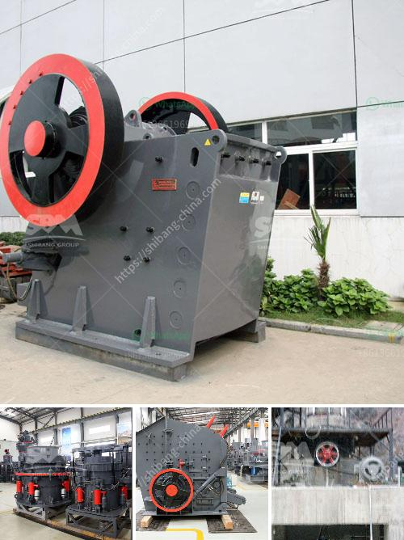

<h3>ball mill small for sale</h3>
A ball mill is a cylindrical device used in grinding or mixing materials like ores, chemicals, ceramic raw materials, and paints. The ball mill rotates around a horizontal axis, partially filled with the material to be ground plus the grinding medium. Different materials are used as media, including ceramic balls, flint pebbles, and stainless steel balls. 

In the mining industry, ball mills are used to extract valuable metals from ores. However, ball mills are also used in various other industries including pharmaceuticals, paints, and ceramics. Regardless of the industry, the size of the ball mill determines its effectiveness and efficiency in grinding, hence the availability of small ball mills for sale.

Small ball mill for sale offers a cost-effective solution compared to large-scale industrial milling. Considering the compact size of these ball mills, they can be easily accommodated in any small-scale production plant making them convenient for usage. Additionally, small ball mills can be operated manually or automatically, depending on the requirements of the users.

The versatility of small ball mills enables they to be used in both wet and dry grinding processes. However, the wet grinding process requires the use of water, making it more time-consuming and expensive in terms of water consumption. Conversely, dry grinding results in less maintenance, reduced costs, and faster grinding.

The production capacity of small ball mills varies from few grams of solid material per hour to several tons. The final product obtained from the small ball mill has a uniform fineness and particle size, making it suitable for further processing or direct use.

When looking to purchase a small ball mill, several factors should be taken into consideration. These include the materials to be processed, the desired fineness, the production capacity required, and the available space for installation.

In conclusion, small ball mill for sale provides a cost-effective and efficient option for grinding materials in small-scale production plants. These mills are versatile and can be operated manually or automatically, depending on the user's preference. The availability of small ball mills in various sizes makes it convenient for different industries. It is crucial to consider specific requirements and available space before purchasing a small ball mill, ensuring optimal usage and performance.
<h3>Contact us</h3><ul><li><strong>Whatsapp:&nbsp;<a href="https://wa.me/8613661969651">+8613661969651</a></strong></li><li><a href="https://swt.shibang-china.com/?git&amp;zhl&amp;ball mill small for sale"><strong>Online Service(chat now)</strong></a></li></ul><h3>Related</h3><ul><li><a href='ball mills south africa.md'>ball mills south africa</a></li><li><a href='200 tph coal crushing process.md'>200 tph coal crushing process</a></li><li><a href='sand screen with vibrator.md'>sand screen with vibrator</a></li><li><a href='feldspar ball mill porcess.md'>feldspar ball mill porcess</a></li><li><a href='quarry stone crusherequipment.md'>quarry stone crusherequipment</a></li></ul>