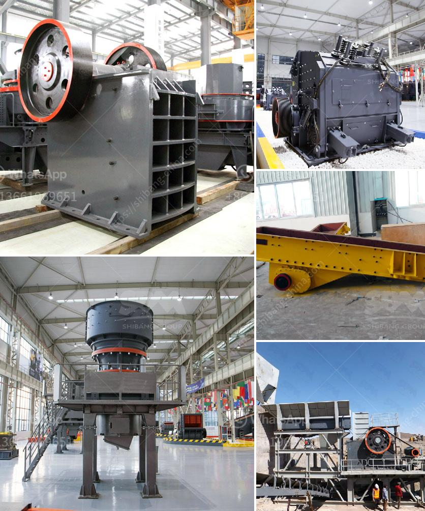

<h3>ball milling machine in south africa</h3>
Ball milling machine is mechanical equipment used for grinding materials such as ores, coal, chemicals, ceramic raw materials, and more. With the aim of crushing and grinding materials, the ball milling machine is a versatile device that can be used for a wide range of applications.

In South Africa, ball milling machines are widely used for manufacturing industries such as cement, silicate, new building materials, refractory materials, fertilizers, ferrous and non-ferrous metal beneficiation, and glass ceramics. These machines are highly efficient and robust, and can easily grind different types of materials.

One of the main advantages of using a ball milling machine is its ability to produce a fine grind, which is necessary for many industrial processes. This is achieved by using balls of different sizes and materials, depending on the type of material being ground. The size and type of balls used in the milling machine also affect the grinding process and the final product quality.

The ball milling machine consists of a hollow cylindrical shell that rotates around its axis. Inside the shell, there are grinding media, such as balls or rods, which are filled with the material to be ground. As the shell rotates, the grinding media are lifted and then fall back onto the material, resulting in the desired grind.

In addition to its grinding capabilities, the ball milling machine also has the ability to mix materials. This is particularly useful in the manufacturing of ceramics and other composite materials. By adding different ingredients during the grinding process, the machine can ensure that the final product has the desired properties.

South Africa is known for its rich mineral resources, contributing significantly to the country's economy. As a result, the mining industry is a vital sector in South Africa. The ball milling machine plays an important role in the grinding and mineral processing tasks of various mines, contributing to the extraction of valuable minerals from the ore bodies.

With the continuous development of technology, the ball milling machine has undergone significant improvements to ensure better performance and efficiency. Modern ball mills are equipped with advanced control systems, such as digital displays and automatic feeders, which enhance the productivity and accuracy of the grinding process.

Furthermore, the ball milling machine is also known for its energy-saving capabilities. By using a combination of high-quality grinding media and efficient motor systems, these machines can significantly reduce energy consumption, resulting in cost savings for the manufacturing industries.

In conclusion, the ball milling machine is a versatile and efficient device that plays a crucial role in various industries in South Africa. It offers a fine grind and mixing capabilities, and its energy-saving features make it an attractive choice for manufacturing processes. With ongoing technological advancements, the ball milling machine continues to contribute to the growth and success of South Africa's manufacturing and mining sectors.
<h3>Contact us</h3><ul><li><strong>Whatsapp:&nbsp;<a href="https://wa.me/8613661969651">+8613661969651</a></strong></li><li><a href="https://swt.shibang-china.com/?git&amp;zhl&amp;ball milling machine in south africa"><strong>Online Service(chat now)</strong></a></li></ul><h3>Related</h3><ul><li><a href='cement mill plant design drawings.md'>cement mill plant design drawings</a></li><li><a href='ballast making machine for sale.md'>ballast making machine for sale</a></li><li><a href='ball mills china.md'>ball mills china</a></li><li><a href='propel stone crusher.md'>propel stone crusher</a></li><li><a href='concrete crusher price in zimbabwe.md'>concrete crusher price in zimbabwe</a></li></ul>