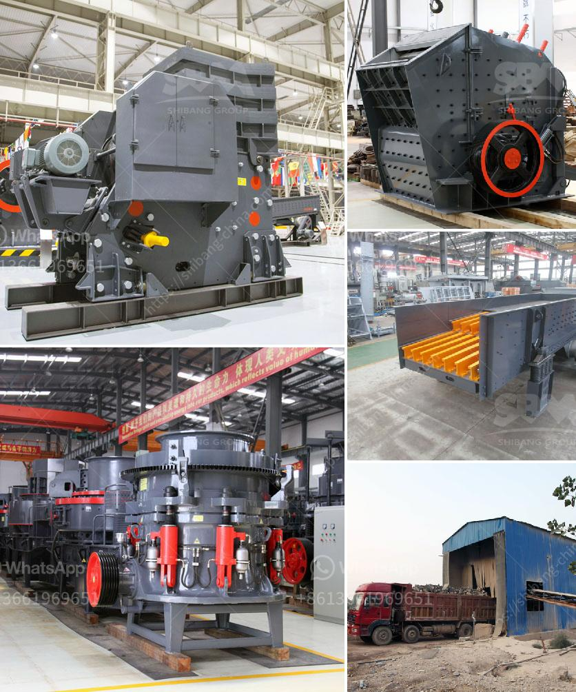

<h3>ball milling price</h3>
Ball milling is a mechanical technique widely used to grind powders into fine particles and blend materials. Being an environmentally-friendly and cost-effective technique, this process has found applications in several industries. Ball milling price, which is the cost of purchasing and maintaining the equipment, is essential for any company or individual looking to invest in this technology.

The price of a ball mill depends on its capacity, performance, and the materials to be processed. Some equipment may be accompanied by additional features such as cooling systems, adjustable speed settings, and programmable controls. This can significantly impact the price. To determine the right ball milling price, one should consider the application requirements, budget, and expected return on investment.

Several factors contribute to the varying prices of ball mills. Firstly, the size of the machine is an important consideration. Benchtop models are smaller and less expensive, suitable for small-scale production or laboratory experiments. On the other hand, larger industrial models can handle higher volumes of material and demand a higher price. A larger machine may also require more extensive installation and maintenance procedures, which can add to the overall cost.

The quality and durability of the materials used to manufacture the ball mill can also influence its price. High-quality components, such as stainless steel or ceramic, are often more expensive but offer better performance and longevity. Cheaper alternatives, such as plastic or lower-grade metals, may be suitable for less demanding applications but can result in decreased effectiveness and shorter equipment lifespan.

Manufacturing costs also impact the final price of the ball mill. Different regions or manufacturers may have varying production costs, which can be reflected in the selling price. Additionally, market demand and competition can affect the pricing strategy of suppliers. It is advisable to compare prices from different suppliers and evaluate the reputation and customer reviews of each manufacturer.

When evaluating the ball milling price, it is essential to consider the long-term operating costs. Energy consumption, maintenance requirements, and the frequency of replacement parts should be factored in. Machines with energy-efficient features or designed for easy maintenance might have a higher upfront cost but could result in significant savings over time.

Furthermore, warranties and customer support should also be taken into account. Reliable suppliers often provide warranties that cover manufacturing defects and technical assistance for troubleshooting. While these may increase the initial price, they can prove invaluable should any issues arise, saving time and money in the long run.

In conclusion, when considering the ball milling price, several factors need to be considered. These include the machine's capacity, additional features, quality of materials, manufacturing costs, long-term operating costs, and customer support. With thorough research and careful analysis, one can align their purchasing decisions with their budget and requirements, ensuring a successful investment in ball milling technology.
<h3>Contact us</h3><ul><li><strong>Whatsapp:&nbsp;<a href="https://wa.me/8613661969651">+8613661969651</a></strong></li><li><a href="https://swt.shibang-china.com/?git&amp;zhl&amp;ball milling price"><strong>Online Service(chat now)</strong></a></li></ul><h3>Related</h3><ul><li><a href='jaw crusher mem fr.md'>jaw crusher mem fr</a></li><li><a href='marbel grinding process.md'>marbel grinding process</a></li><li><a href='series capacitor for crushing plant.md'>series capacitor for crushing plant</a></li><li><a href='company that work in crushing stones.md'>company that work in crushing stones</a></li><li><a href='jaw crusher for graphite.md'>jaw crusher for graphite</a></li></ul>