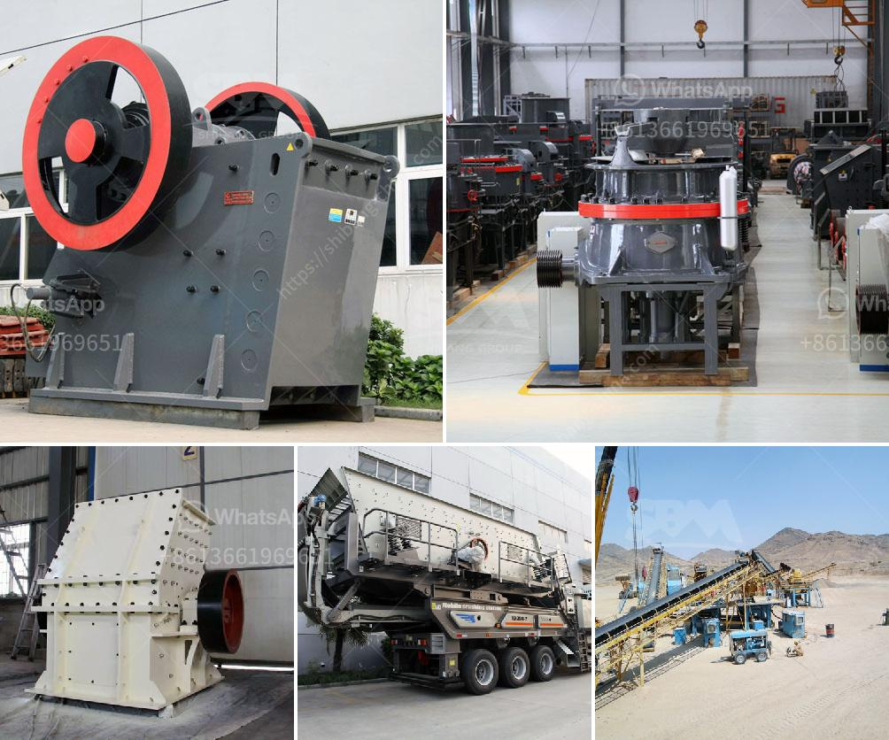

<h3>ball mills brands</h3>
Ball mills are a type of grinding mill, typically used in the mineral processing industry. They have gained popularity amongst researchers, industrialists, and miners alike due to their ability to grind a variety of materials efficiently. There are various ball mill brands available that cater to different needs, offering unique features and advantages. In this article, we will explore some popular ball mill brands and highlight their key characteristics.

One well-known brand in the ball mill industry is FLSmidth. With a strong focus on sustainability and innovation, FLSmidth offers a wide range of mills suitable for various applications. Their ball mills are designed with advanced technology, ensuring high productivity and energy efficiency. FLSmidth's mills are also renowned for their robust construction and reliable performance, making them a preferred choice for many operators.

Another prominent player in the ball mill market is Metso Outotec. This brand emphasizes durability and reliability, delivering ball mills that can withstand the harshest operating conditions. Metso Outotec's mills are known for their optimized grinding circuit design, resulting in efficient particle size reduction. Additionally, their mills are equipped with advanced controls and monitoring systems for enhanced safety and process optimization.

For those seeking innovative solutions, Retsch is a brand that offers cutting-edge ball mill technology. Retsch's mills are characterized by their high-quality construction and user-friendly design, ensuring accurate and reproducible results. Their ball mills are equipped with state-of-the-art analytical instruments for real-time monitoring and control, allowing users to precisely adjust process parameters as needed.

In the mining industry, brands like FLSmidth, Metso Outotec, and Retsch are trusted choices. However, it is important to note that there are also several other reputable brands in the market. It is advisable to research and consider the specific needs of your application before selecting a brand.

When choosing a ball mill brand, factors such as cost, maintenance requirements, and after-sales service should also be taken into consideration. Some brands offer comprehensive support and training programs to ensure optimal performance and longevity of their mills. Additionally, it is crucial to assess the availability and quality of spare parts to avoid any potential downtime or delays in operations.

In conclusion, ball mills are indispensable equipment in many industries, offering efficient grinding and particle size reduction. FLSmidth, Metso Outotec, and Retsch are some well-established brands that offer a range of ball mills to meet diverse requirements. However, it is essential to thoroughly evaluate features, performance, and support services before making a final decision. Ultimately, selecting the right ball mill brand can significantly impact productivity, cost-effectiveness, and overall operational efficiency.
<h3>Contact us</h3><ul><li><strong>Whatsapp:&nbsp;<a href="https://wa.me/8613661969651">+8613661969651</a></strong></li><li><a href="https://swt.shibang-china.com/?git&amp;zhl&amp;ball mills brands"><strong>Online Service(chat now)</strong></a></li></ul><h3>Related</h3><ul><li><a href='coltan processing plant cost.md'>coltan processing plant cost</a></li><li><a href='equipment stone crushing.md'>equipment stone crushing</a></li><li><a href='sand making plant.md'>sand making plant</a></li><li><a href='companies selling mining equipment in south africa.md'>companies selling mining equipment in south africa</a></li><li><a href='used stone crusher in uganda.md'>used stone crusher in uganda</a></li></ul>