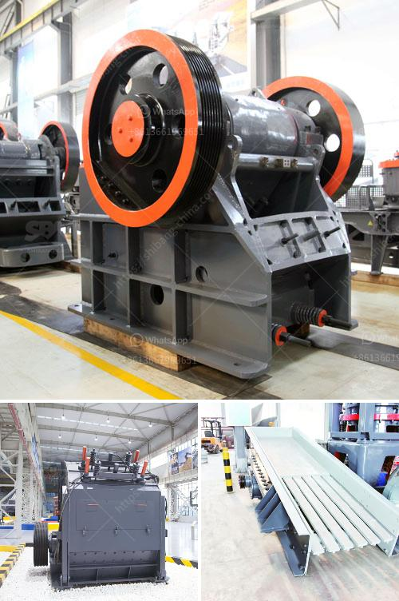

<h3>ball mills china</h3>
Ball mill is an essential piece of machinery equipment for grinding materials into fine powders. A ball mill can be used for both wet and dry grinding, which mainly depends on the operation principle. A ball mill consists of a hollow cylindrical shell rotating about its axis. The axis of the shell may be either horizontal or at a small angle to the horizontal. It is partially filled with balls.

As one of the largest ball mill manufacturers in China, Hongxing Machinery has been providing quality equipment for over 30 years. Beginning with a humble operation, Hongxing has now grown into a major player in the market. Their ball mills are widely used in industries like cement, silicate products, new building materials, refractory materials, fertilizers, black and non-ferrous metal beneficiation, and glass ceramics, just to name a few.

China, being the world's largest producer of cement, is well-known for its booming construction industry. Consequently, the demand for ball mills in China is also growing. Cement companies, power plants, and other industrial companies require these machines to grind materials into the desired sizes. In recent years, the Chinese government has also been heavily investing in infrastructure projects, which further drives the need for ball mills.

Besides its domestic market, Chinese ball mill manufacturers also export their equipment to countries around the world. For instance, Hongxing machinery has supplied its ball mills to over 90 countries. With a strong presence in the global market, China has become a reliable supplier of ball mills and other industrial equipment.

In conclusion, Ball mills China has become a promising market for industrial equipment. With its thriving construction and infrastructure sectors, China continues to attract investments from domestic and international players. As one of the leading manufactures, Hongxing Machinery provides top-notch ball mills that cater to the evolving needs of various industries. As the demand for these machines continues to rise, China is set to maintain its prominence in the ball mill industry.
<h3>Contact us</h3><ul><li><strong>Whatsapp:&nbsp;<a href="https://wa.me/8613661969651">+8613661969651</a></strong></li><li><a href="https://swt.shibang-china.com/?git&amp;zhl&amp;ball mills china"><strong>Online Service(chat now)</strong></a></li></ul><h3>Related</h3><ul><li><a href='copper crusher manufacturer.md'>copper crusher manufacturer</a></li><li><a href='safety of conveyor belt ppt.md'>safety of conveyor belt ppt</a></li><li><a href='iron ore mines buyers in india.md'>iron ore mines buyers in india</a></li><li><a href='cone crusher dimension specification.md'>cone crusher dimension specification</a></li><li><a href='manufacturer of cement packing plant machine.md'>manufacturer of cement packing plant machine</a></li></ul>