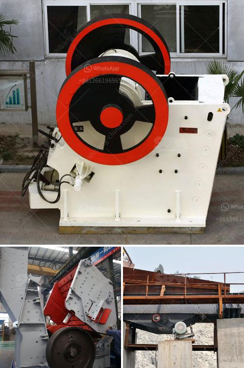

<h3>ball mills manufacturers in india</h3>
The Indian market is full of possibilities for manufacturers and suppliers of ball mills. With strong demand for grinding and milling machinery, there is a great opportunity for manufacturers in India to expand their business and tap into the country’s immense potential.

Ball mills are widely used in various industrial sectors such as cement, iron ore, and ceramics. These mills come in different sizes and capacities, depending on the requirements of the application. India is the third largest producer of coal in the world, making it a highly attractive market for ball mill manufacturers. Coal-based power plants generate enormous amounts of coal dust, which can be highly explosive and dangerous when exposed to air. Ball mills are crucial in reducing the risk of explosion and fire since they can grind the coal to a fine powder.

One of the leading manufacturers of ball mills in India is NHI India International. They specialize in manufacturing heavy-duty, industrial-grade mills that are specifically designed to withstand extreme conditions. NHI India International’s ball mills are built with unmatched durability and reliability, ensuring a long service life and minimal maintenance.

Another prominent player in the market is RTechno, a manufacturer known for its innovative approach and cutting-edge technology. RTechno’s ball mills are designed to deliver superior performance in terms of grinding efficiency, low energy consumption, and high output. With a strong focus on research and development, RTechno continuously strives to improve the design and functionality of their mills.

Apart from these, there are several other manufacturers in India who offer high-quality ball mills. Companies like Eros Envirotech, Promas Engineers, and Laxmi Engineers are known for their expertise in designing and manufacturing ball mills that meet the specific needs of their customers. These manufacturers prioritize quality, efficiency, and customer satisfaction, ensuring that their products are at par with international standards.

India’s ball mills market is highly competitive, with manufacturers constantly striving to provide cost-effective solutions without compromising on quality. In addition to their competitive pricing, manufacturers in India also benefit from the country’s vast network of suppliers and skilled labor. This enables them to source high-quality raw materials at affordable prices, which ultimately translates into competitive pricing for their customers.

Furthermore, the Indian government's initiatives for infrastructural development and the push for renewable energy projects create a potential market for ball mills. As the demand for cement, iron ore, and other raw materials increases, so does the need for efficient grinding and milling solutions, which ball mills provide.

In conclusion, Indian manufacturers of ball mills have a huge opportunity to expand their business and tap into the growing demand in various industries. With their focus on quality, innovation, and cost-effectiveness, these manufacturers are well-positioned to meet the requirements of the Indian market while competing globally. As the industrial sector in India continues to grow, ball mills will play a crucial role in ensuring efficient and effective processing of raw materials.
<h3>Contact us</h3><ul><li><strong>Whatsapp:&nbsp;<a href="https://wa.me/8613661969651">+8613661969651</a></strong></li><li><a href="https://swt.shibang-china.com/?git&amp;zhl&amp;ball mills manufacturers in india"><strong>Online Service(chat now)</strong></a></li></ul><h3>Related</h3><ul><li><a href='gold mining and washing machine usa.md'>gold mining and washing machine usa</a></li><li><a href='small rock gravel crushers.md'>small rock gravel crushers</a></li><li><a href='stone crusher machine china.md'>stone crusher machine china</a></li><li><a href='brazil best crusher manufacturing companies.md'>brazil best crusher manufacturing companies</a></li><li><a href='price list of grinding equipment for sale.md'>price list of grinding equipment for sale</a></li></ul>