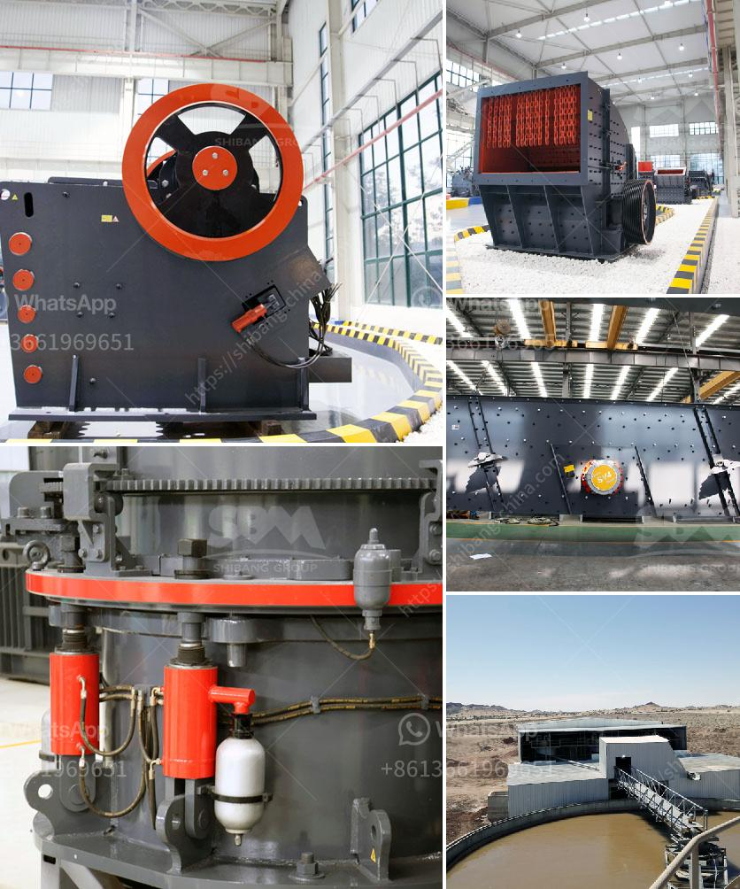

<h3>ball mills mfg in kenya</h3>
Ball mills are a type of grinder used to grind and blend materials for use in various industries, such as cement production, power generation, pharmaceuticals, ceramics, and paints. In Kenya, these machines are primarily used for mining and processing raw materials such as limestone, quartz, iron ore, and others.

The ball mill is comprised of cylindrical shell rotating on its axis, which is mounted on a sturdy frame. The mill's shell is loaded with steel balls, which are lifted by the rotation of the shell and cause the grinding media to fall onto the material to be ground. The cylindrical shell is typically made of mild steel plates and is lined with rubber or wear-resistant materials to protect the shell and minimize contamination from the grinding media.

In Kenya, ball mills are manufactured by various companies, which employ highly skilled professionals to ensure the machines meet the necessary quality and performance standards required for the mining industry. These manufacturers use modern technology and equipment to design and produce robust ball mills that can withstand the harsh conditions of the mining sector.

One of the leading manufacturers of ball mills in Kenya is Mabati Rolling Mills Limited (MRM). They provide high-quality mills that are widely used in the mining industry. MRM has a well-established reputation for manufacturing durable and efficient ball mills that can grind a wide range of materials.

MRM's ball mills are designed with advanced technology and precise engineering to ensure optimal performance and reliability. The company uses high-quality materials for the construction of the mills, such as stainless steel, which is known for its resistance to corrosion and wear. This ensures that the ball mills can withstand the abrasion caused by the grinding media and maintain their efficiency over time.

Furthermore, MRM's ball mills are equipped with state-of-the-art control systems to ensure accurate and consistent grinding results. These control systems monitor various parameters such as mill speed, ball charge, and material feed rate to optimize the grinding process and minimize energy consumption. This results in significant cost savings for the mining companies in terms of electricity usage and grinding media replacement.

In addition to MRM, there are other local manufacturers in Kenya that also produce ball mills for the mining industry. These manufacturers play a crucial role in providing essential equipment for the development and growth of the mining sector in the country. Their contribution to the economy by creating employment opportunities and promoting local manufacturing cannot be overstated.

In conclusion, the manufacturing of ball mills in Kenya is an important sector in the country's mining industry. These machines play a critical role in grinding and blending materials to produce the desired end product. Manufacturers like MRM and others employ skilled professionals and use advanced technology to produce high-quality and efficient mills that meet the needs of the mining industry. With their contributions, Kenya can continue to benefit from the extraction and processing of its rich natural resources.
<h3>Contact us</h3><ul><li><strong>Whatsapp:&nbsp;<a href="https://wa.me/8613661969651">+8613661969651</a></strong></li><li><a href="https://swt.shibang-china.com/?git&amp;zhl&amp;ball mills mfg in kenya"><strong>Online Service(chat now)</strong></a></li></ul><h3>Related</h3><ul><li><a href='clay grinder machine kerala.md'>clay grinder machine kerala</a></li><li><a href='india vertical grinding machines.md'>india vertical grinding machines</a></li><li><a href='dicalcium phosphate production line.md'>dicalcium phosphate production line</a></li><li><a href='crusher and wash plant for sale in china.md'>crusher and wash plant for sale in china</a></li><li><a href='chrome beneficiation plant china.md'>chrome beneficiation plant china</a></li></ul>