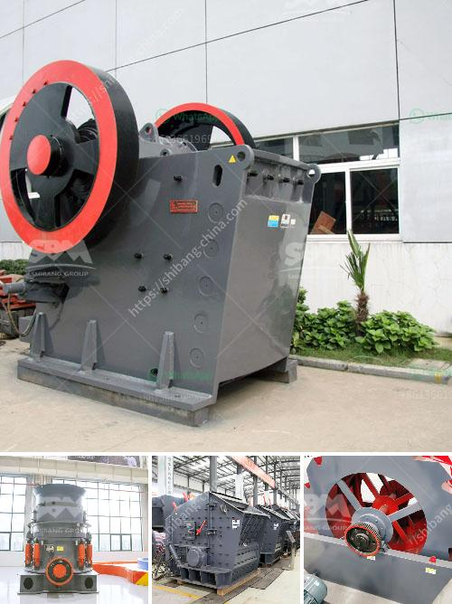

<h3>ball mills south africa</h3>
Ball mills are used throughout South Africa in the mining industry, where they grind ore to fine particles for further processing. This is due to their high capacity and efficiency. In addition, ball mills are also used for grinding materials in the construction industry, such as limestone and clinker.

A ball mill consists of a cylindrical drum, which rotates on its axis. Inside the drum, there are grinding media, such as steel balls, that act as a medium for the ore to be ground. As the drum rotates, the ore is fed into the drum through a chute, and the grinding media pound and grind the ore into fine particles. The size of the final product is determined by the size of the openings in the drum, as well as the speed of rotation.

South Africa is a prominent player in the world's mining industry, and ball mills are a crucial aspect of their operations. Typically, this country has a large number of mine sites where sophisticated and efficient ball mills are employed to carry out the grinding process. These mills are highly durable and capable of withstanding harsh mining conditions, making them ideal for South Africa's demanding mining industry.

One of the key advantages of ball mills is their ability to handle a wide range of materials. They can effectively grind both wet and dry materials, which is especially beneficial in South Africa, where there may be variations in moisture content. This versatility allows businesses to optimize their grinding processes and achieve the desired particle size for downstream operations.

Furthermore, ball mills are also known for their low operating costs. Compared to other grinding solutions, such as vertical mills, ball mills generally have lower energy consumption and maintenance costs. This makes them a cost-effective choice for companies in South Africa, where cost efficiency is crucial.

In recent years, technological advances have further enhanced the efficiency of ball mills in South Africa. For instance, some mills now incorporate advanced control systems that optimize the grinding process and ensure consistent and reliable performance. These control systems can adjust the speed of rotation, regulate the feed rate, and monitor the grinding media, among other parameters. This level of control allows businesses to maximize their productivity while minimizing energy consumption, leading to significant cost savings.

In conclusion, ball mills play a critical role in the mining and construction industries in South Africa. Their ability to grind a wide range of materials, coupled with their cost-effective operation, makes them a preferred choice for companies operating in this region. With ongoing technological advancements, ball mills are likely to continue to be an important tool in South Africa's mining and construction sectors.
<h3>Contact us</h3><ul><li><strong>Whatsapp:&nbsp;<a href="https://wa.me/8613661969651">+8613661969651</a></strong></li><li><a href="https://swt.shibang-china.com/?git&amp;zhl&amp;ball mills south africa"><strong>Online Service(chat now)</strong></a></li></ul><h3>Related</h3><ul><li><a href='crusher for rocks machine for sale in uae.md'>crusher for rocks machine for sale in uae</a></li><li><a href='alluvial chrome wash plant.md'>alluvial chrome wash plant</a></li><li><a href='marble mining equipment manufacturers.md'>marble mining equipment manufacturers</a></li><li><a href='china clay processing.md'>china clay processing</a></li><li><a href='kenya granite stone crushing plant.md'>kenya granite stone crushing plant</a></li></ul>