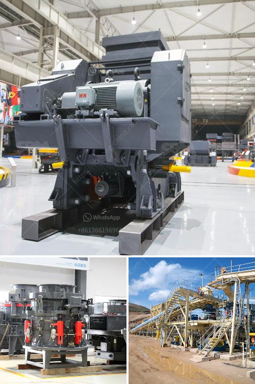

<h3>ballast crushers cost</h3>
Ballast refers to coarse gravels used to form the foundation of a railway track. The function of ballast in railroads is to transfer loads from the rails to the underlying subgrade. Ballast crushers are widely used to deal with ballast and subgrade in railway construction, especially in modern railways.

According to ballast crushers' characteristics, compression and impact factors to ensure its final products rounded edges are better; the broken stone hardness should be relatively high. Meanwhile, hardness is harder than average, with compression strength is large, the durability and reliability of impact crusher tends to be better.

The cost of ballast crushers depends on many factors such as the type of crusher and the difference in output. A typical ballast crusher machine generally has a high cost, and the throughput capacity is relatively low compared with other machinery in the same category. However, some ballast crushers have the advantage of saving energy and saving costs in many ways. These optimized crushers can perform the primary crushing and secondary crushing efficiently in one go. Customers can achieve high productivity and cost savings by using these crushers.

Regarding the power source of the ballast crusher, the customers can select either electric or diesel engines. The use of diesel generators can protect the environment and save costs. The output compared with the traditional crusher can be increased by 30-40%, and the unit power consumption cost is saved by about 30%.

Moreover, the installation of dust removal devices can effectively reduce the amount of dust generated during the crushing process, significantly reducing environmental pollution. It not only focuses on improving the working environment but also reduces pollution and subsequent processing costs.

Furthermore, the choice of materials for ballast crushers also affects their cost. In general, hard and durable materials are more expensive, but they can improve the service life and reduce maintenance costs of the equipment in the long run. Therefore, it is essential to choose high-quality materials that can withstand the high impact during the crushing process.

In conclusion, ballast crushers cost depends on various factors and needs to be determined after considering all the aspects. Considering the mentioned factors, you can select the most suitable machine for your project. It is advised to conduct proper research, compare prices, and invest in a machine that offers high productivity, energy efficiency, and low maintenance requirements. By investing wisely in a ballast crusher machine, you can save costs both in the short term and long term, ensuring a smooth and efficient railway construction process.
<h3>Contact us</h3><ul><li><strong>Whatsapp:&nbsp;<a href="https://wa.me/8613661969651">+8613661969651</a></strong></li><li><a href="https://swt.shibang-china.com/?git&amp;zhl&amp;ballast crushers cost"><strong>Online Service(chat now)</strong></a></li></ul><h3>Related</h3><ul><li><a href='manufacturing of marble and granite crusher machines.md'>manufacturing of marble and granite crusher machines</a></li><li><a href='quote for sand making machine.md'>quote for sand making machine</a></li><li><a href='marble crusher manufacturer.md'>marble crusher manufacturer</a></li><li><a href='ceramic various method of crushing and grinding.md'>ceramic various method of crushing and grinding</a></li><li><a href='rent a conveyor belts singapur.md'>rent a conveyor belts singapur</a></li></ul>