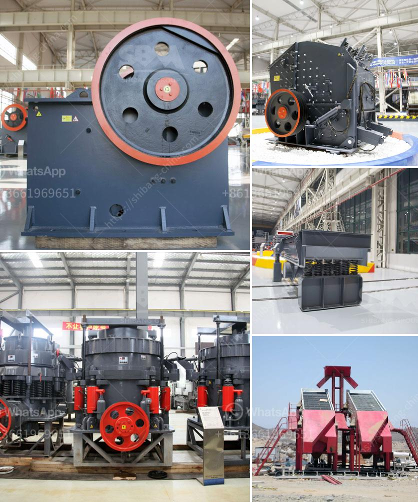

<h3>ballast making machine for sale</h3>
Ballast, as a necessary component in railway tracks, plays a crucial role in ensuring the safety and stability of the trains. It is the crushed stones that are laid underneath the railway tracks, providing a solid foundation and stabilizing the tracks against the constant pressure exerted by passing trains. With growing advancements in technology, the demand for proficient ballast making machines has dramatically increased.

A ballast making machine is a vital piece of equipment used for compressing or vibrating large stones and gravels into a perfect-sized ballast. These stones are integral for the tracks' foundation, preventing the rails from moving or misaligning while trains pass by. Investing in a ballast making machine is a wise decision for those seeking lucrative business opportunities in the construction or railway sector.

When considering purchasing a ballast making machine, there are a few factors to consider. Firstly, the machine's efficiency and output capacity should be carefully examined. It is advisable to select a machine that can produce a sufficient quantity of ballast without compromising quality. Additionally, durability and ease of maintenance are essential aspects to bear in mind, as these machines can undergo heavy use in the long run.

One of the easiest ways to find a suitable ballast making machine is by exploring the market for sales options. Numerous manufacturers and suppliers offer ballast making machines for sale. It is important to conduct thorough research, compare prices, and inquire about the machine's specifications from multiple vendors before making a decision.

Not only does purchasing a ballast making machine provide an opportunity to cater to the construction and railway industries' needs, but it also opens doors for potential collaborations with railway contractors and operators. The constant demand for ballast ensures a steady flow of business, making this investment an attractive prospect for entrepreneurs.

In conclusion, the sale of ballast making machines presents a promising investment opportunity for those interested in the construction and railway sectors. With the increasing demand for high-quality ballast, there is potential for long-term profitability and business growth. By carefully evaluating the features, efficiency, and durability of available machines, entrepreneurs can seize this opportunity and contribute to the development of the rail transport infrastructure.
<h3>Contact us</h3><ul><li><strong>Whatsapp:&nbsp;<a href="https://wa.me/8613661969651">+8613661969651</a></strong></li><li><a href="https://swt.shibang-china.com/?git&amp;zhl&amp;ballast making machine for sale"><strong>Online Service(chat now)</strong></a></li></ul><h3>Related</h3><ul><li><a href='stone crusher machine for sale.md'>stone crusher machine for sale</a></li><li><a href='jaw crusher with different size supplier in india.md'>jaw crusher with different size supplier in india</a></li><li><a href='crusher machinery from china.md'>crusher machinery from china</a></li><li><a href='stone crusher quarry.md'>stone crusher quarry</a></li><li><a href='crushing jaw crusher.md'>crushing jaw crusher</a></li></ul>