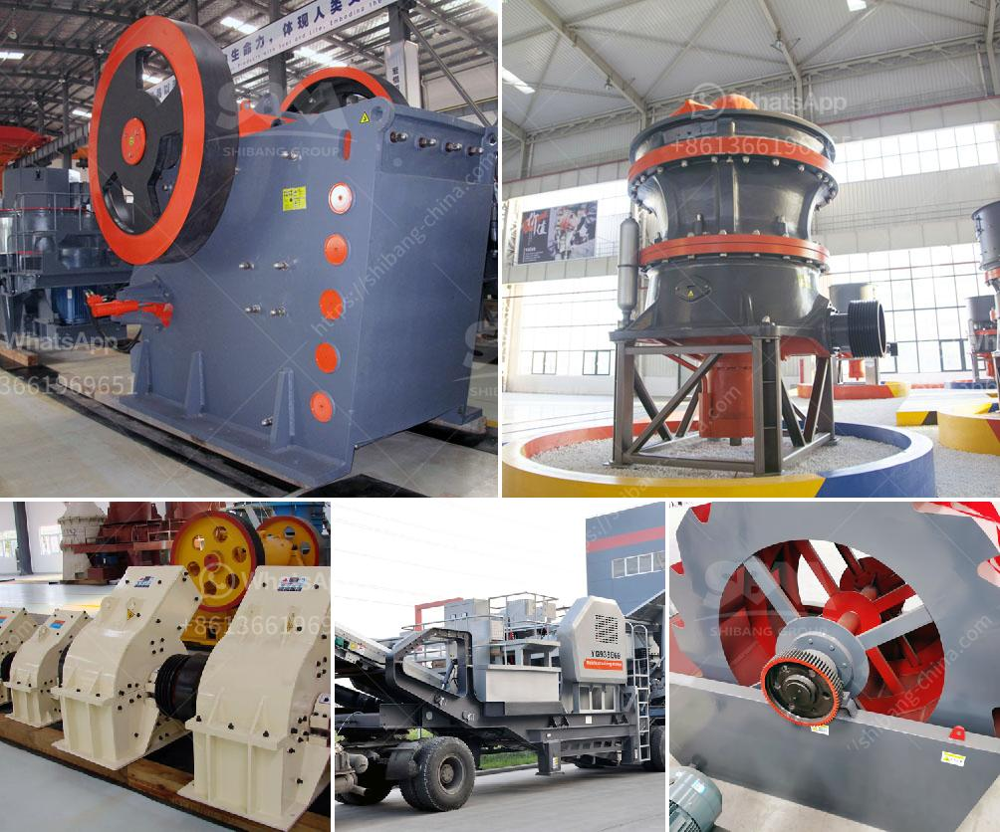

<h3>barite bulking process</h3>
Barite is a mineral composed of barium sulfate (BaSO4) that holds immense importance in various industries. With its versatile properties, barite finds applications in oil and gas drilling, paints and coatings, healthcare, and many more. However, to make barite suitable for these diverse applications, it often undergoes a bulking process, a crucial step that enhances its properties and performance.

The bulking process involves several stages, starting from the extraction of barite ore from mines. While barite is naturally occurring, it is often found combined with other minerals, making it imperative to separate it through a beneficiation process. The ore is pulverized and subjected to various physical and chemical processes to remove impurities, such as quartz, calcite, and iron oxides, which could affect the end product's quality and functionality.

Once the impurities are eliminated, the refined barite undergoes a grinding process to reduce its size to a finer powder. This grinding process is vital in achieving the desired particle size distribution, which determines the rheological properties of the final product. Fine grinding ensures that barite particles are evenly dispersed, allowing for better suspension in liquids, improved flowability, and enhanced stability.

After grinding, the bulking process continues with the addition of various modifiers and additives to further enhance the properties of barite. These additives can include dispersants, surfactants, and rheology modifiers, each serving a specific purpose. Dispersants help in breaking down the agglomerated particles, promoting proper dispersion and preventing particle settling. Surfactants, on the other hand, improve the wetting and adhesion properties of barite, ensuring its compatibility with other materials and enhancing its binding capabilities.

Rheology modifiers play a crucial role in controlling the flow behavior of barite suspensions. By adjusting the rheological properties, such as viscosity and yield stress, manufacturers can tailor barite to meet specific application requirements. For instance, in oil drilling, barite is often used as a weighting agent to control drilling fluid density, hence balancing the pressure and stabilizing the borehole. By adjusting the rheology, the suspension can maintain the desired density, preventing fluid loss and ensuring efficient drilling operations.

The bulking process concludes with careful quality control and testing of the final product. Samples are taken and analyzed to ensure that the refined barite meets all required specifications, such as particle size distribution, purity, and chemical composition.

In conclusion, the bulking process plays a crucial role in enhancing the properties of barite, a versatile mineral used in numerous industries. By removing impurities, grinding to a fine powder, and incorporating additives, barite is optimized for specific applications, such as oil drilling or paint manufacturing. Through this process, the rheological properties can be tailored, ensuring better suspension, improved flowability, and enhanced stability. With the final product meeting stringent quality control measures, the bulking process guarantees that barite fulfills its role as a reliable and valued material, contributing to the success of various sectors.
<h3>Contact us</h3><ul><li><strong>Whatsapp:&nbsp;<a href="https://wa.me/8613661969651">+8613661969651</a></strong></li><li><a href="https://swt.shibang-china.com/?git&amp;zhl&amp;barite bulking process"><strong>Online Service(chat now)</strong></a></li></ul><h3>Related</h3><ul><li><a href='industrial mill crusher price.md'>industrial mill crusher price</a></li><li><a href='barite bulking process.md'>barite bulking process</a></li><li><a href='mica minerals powder grinding unit in kenya.md'>mica minerals powder grinding unit in kenya</a></li><li><a href='hammer mill rock crusher.md'>hammer mill rock crusher</a></li><li><a href='mobile vibrating screens.md'>mobile vibrating screens</a></li></ul>