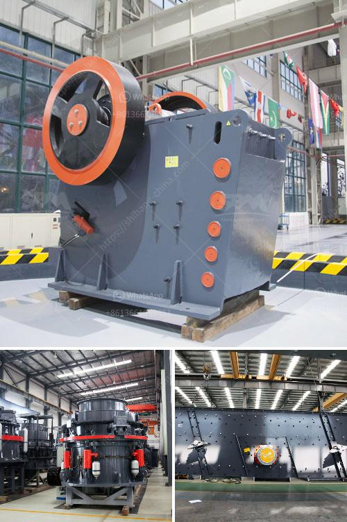

<h3>barite crusher price</h3>
Barite, also known as baryte, is a mineral commonly found in sedimentary rocks. It is mainly composed of barium sulfate and has a wide range of uses. One of its primary applications is in the oil and gas industry, where barite is used as a weighting agent in drilling fluids to control the pressure and prevent blowouts.

As demand for barite continues to grow, the need for efficient crushing equipment becomes more important. Barite crushers are machines specifically designed to reduce the size and weight of barite mineral rocks. This process effectively breaks down the barite into smaller particles, making it easier to extract and process. Consequently, the price of barite crushers plays a significant role in determining the overall cost of barite extraction.

The price of a barite crusher is influenced by various factors, including the type, model, and technical specifications. These factors impact the machine's capacity, power consumption, and crushing efficiency. Typically, the more advanced the crusher's features, the higher its price. Therefore, it is crucial to consider the specific requirements and production needs when selecting a barite crusher.

In general, barite crushers can be divided into two main categories: jaw crushers and impact crushers. Jaw crushers are primarily used for coarse crushing, while impact crushers are commonly used for secondary or tertiary crushing. Both types of crushers have their advantages and disadvantages, and the final choice depends on the specific application.

When it comes to price, jaw crushers tend to be more affordable than impact crushers. This is primarily due to their simpler design and lower production capacity. However, jaw crushers may require additional maintenance and have a higher risk of clogging or needing frequent repairs. On the other hand, impact crushers have higher production capacities, but they are usually pricier.

The price range for a barite crusher can vary significantly depending on the model and manufacturer. Generally, prices for barite crushers range from $10,000 to $50,000. It is essential to consider factors such as market competition, manufacturing technology, and after-sales service when evaluating the price of a barite crusher.

To ensure you get the best value for your investment, it is advisable to compare prices and features from different manufacturers. Look for reputable manufacturers known for producing high-quality crushers. Additionally, consider the availability of spare parts and the after-sales service offered by the manufacturer.

In conclusion, the price of a barite crusher varies based on numerous factors, including the type, model, and technical specifications. Carefully evaluate your specific needs and production requirements before making a purchase. Conduct thorough research on different manufacturers to ensure you get the best quality and price for your barite crusher. By doing so, you can optimize your barite extraction process and minimize overall costs.
<h3>Contact us</h3><ul><li><strong>Whatsapp:&nbsp;<a href="https://wa.me/8613661969651">+8613661969651</a></strong></li><li><a href="https://swt.shibang-china.com/?git&amp;zhl&amp;barite crusher price"><strong>Online Service(chat now)</strong></a></li></ul><h3>Related</h3><ul><li><a href='price of ballast per ton in kenya.md'>price of ballast per ton in kenya</a></li><li><a href='ball mill manufacturers in korea.md'>ball mill manufacturers in korea</a></li><li><a href='stone crusher plant kapasitas 60 ton h.md'>stone crusher plant kapasitas 60 ton h</a></li><li><a href='mini rock crusher.md'>mini rock crusher</a></li><li><a href='industrial hammer mill malaysia.md'>industrial hammer mill malaysia</a></li></ul>