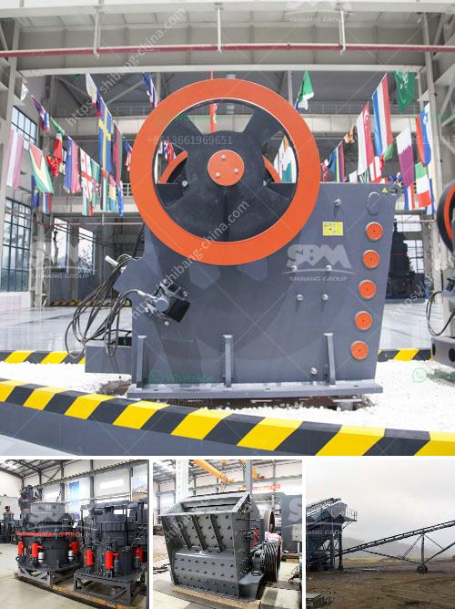

<h3>barite grinding plant machine sale</h3>
Barite is a mineral that is found in nature as barium sulfate (BaSO4). It is highly sought after for its use in various industrial applications due to its unique properties. One of the most common uses of barite is in the oil and gas industry, where it is used as a weighting agent in drilling fluids to prevent blowouts during drilling operations.

To meet the growing demand for barite, grinding plants are becoming increasingly important as they provide a quick and efficient way to grind barite into fine powder. As the demand for barite continues to rise, many plant owners have started to consider the purchase of grinding machines to grow their businesses.

Grinding plants that produce commercial grade barite are often complex, requiring a large amount of specialized equipment to ensure high quality product. At the heart of these plants is the grinding machine. These machines are designed to grind barite into a fine powder, which is then used in various industrial applications. Different grinding machines are used to grind different grades of barite, ranging from low-grade to high-grade.

When purchasing a grinding machine, it is important to consider factors such as the size of the plant, the required production capacity, and the desired end product. Grinding machines come in various sizes and capacities, ranging from small, bench-top machines suitable for small-scale production, to large, industrial-grade machines capable of processing tons of barite per hour.

In recent years, there has been an increase in the number of grinding machines available for sale, making it easier for plant owners to find the right machine for their specific needs. Online platforms and industry trade shows are great places to explore different options and compare prices.

Investing in a barite grinding plant machine can be a profitable venture. As the demand for barite continues to rise, the market for processed barite will also continue to grow. With the right grinding machine and the right market conditions, barite mining and processing plants can yield significant returns.
<h3>Contact us</h3><ul><li><strong>Whatsapp:&nbsp;<a href="https://wa.me/8613661969651">+8613661969651</a></strong></li><li><a href="https://swt.shibang-china.com/?git&amp;zhl&amp;barite grinding plant machine sale"><strong>Online Service(chat now)</strong></a></li></ul><h3>Related</h3><ul><li><a href='gold ore refinery portable machinery maker china.md'>gold ore refinery portable machinery maker china</a></li><li><a href='kaolin stone crusher.md'>kaolin stone crusher</a></li><li><a href='how much does coal mining machines costs.md'>how much does coal mining machines costs</a></li><li><a href='sizes of vertical shaft kilns.md'>sizes of vertical shaft kilns</a></li><li><a href='crusher machine crusher machine.md'>crusher machine crusher machine</a></li></ul>