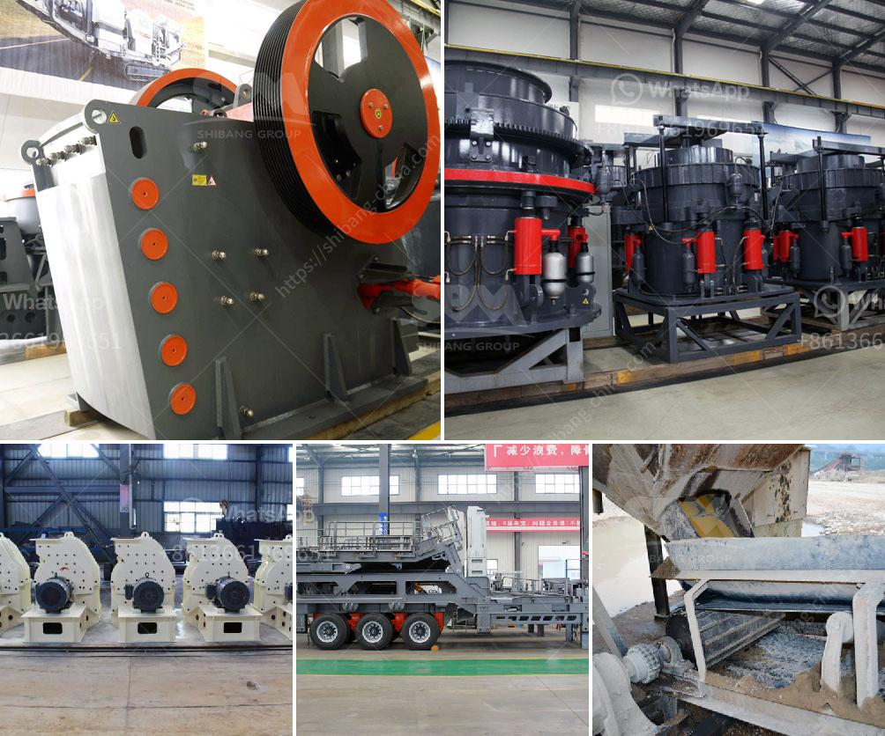

<h3>barite grinding plants</h3>
Barite, or baryte, is a mineral composed of barium sulfate (BaSO4). It is commonly used in various industries like oil and gas exploration, electronics, medical devices, and paint manufacturing. To meet the growing demand for this mineral, barite grinding plants are being established in different parts of the world.

Barite grinding plants are highly specialized facilities built to grind the barite stones into very fine powders suitable for various industrial applications. These plants enable barite producers to increase their production capacity while reducing the size of the end product.

The grinding process involves crushing the barite stones, followed by grinding them into a fine powder. Once ground, the barite powder is then classified through micronizing machines to produce specific size fractions that are suitable for different applications. The finely ground barite powder is then packed and transported to end-users.

One of the primary applications of barite powder is in the oil and gas industry. Barite is added to drilling fluids to increase the density, making it easier to control the pressure and prevent blowouts during drilling operations. It also acts as a lubricant, reducing friction between the drill bit and the wellbore.

In addition to the oil and gas industry, barite powder is also used in the manufacturing of paints, ceramics, glass, rubber, and plastics. Its high density and chemical inertness make it an ideal filler material, improving the strength, durability, and appearance of the finished products.

Establishing barite grinding plants involves significant capital investment and technical expertise. The plants need to have advanced grinding equipment capable of producing a consistently high-quality product. They also require a reliable source of barite stones, which are usually obtained from mines or imported from other countries.

Environmental considerations are also an essential aspect of setting up barite grinding plants. Strict regulations and permits are required to ensure minimal impact on the surrounding environment. These plants also need to install appropriate pollution control systems to mitigate dust emissions and water contamination.

The location of barite grinding plants plays a crucial role in determining their success. Proximity to the source of barite stones and access to transportation infrastructure are significant factors to consider. Setting up the plants in close proximity to oil and gas exploration sites, manufacturing hubs, or ports can help reduce logistics costs and enhance operational efficiency.

In conclusion, barite grinding plants are vital facilities for processing and preparing barite stones into fine powder. With the increasing demand for barite in various industries, these plants are crucial for ensuring a continuous supply of this mineral. The establishment of such plants requires significant investment and careful planning to ensure efficient operations while minimizing environmental impacts.
<h3>Contact us</h3><ul><li><strong>Whatsapp:&nbsp;<a href="https://wa.me/8613661969651">+8613661969651</a></strong></li><li><a href="https://swt.shibang-china.com/?git&amp;zhl&amp;barite grinding plants"><strong>Online Service(chat now)</strong></a></li></ul><h3>Related</h3><ul><li><a href='granite stone hand engraving machine in india.md'>granite stone hand engraving machine in india</a></li><li><a href='gypsum crushing machine for sale india.md'>gypsum crushing machine for sale india</a></li><li><a href='vibrating screen price philippines.md'>vibrating screen price philippines</a></li><li><a href='tonne ball mill.md'>tonne ball mill</a></li><li><a href='micro powder grinding mill.md'>micro powder grinding mill</a></li></ul>