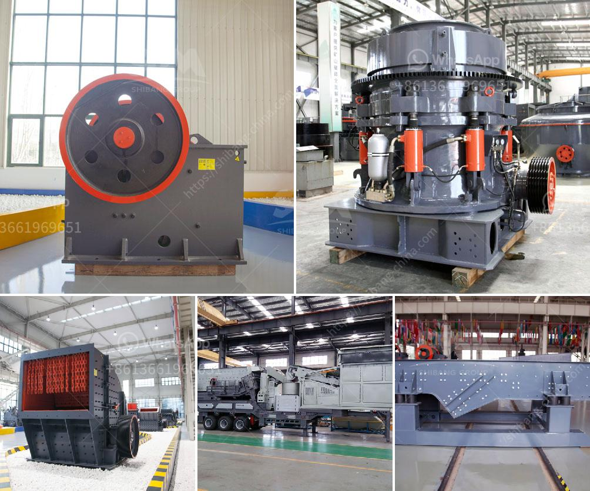

<h3>barite mining and quarry equipment spain</h3>
Barite, also known as barium sulfate, is an essential mineral used in the manufacturing of paints, pigments, glass, ceramics, and medical equipment. It is also found in various industries such as automotive, aerospace, electronics, oil and gas, and more. One of the major global producers of barite is Spain, which is known for its high-quality deposits.

Spain has a long history of barite mining and quarrying activities. In fact, it has been one of the leading producers of barite for many years. With its favorable geological conditions and diverse mineral resources, Spain has attracted numerous mining companies from around the world. These companies have invested in advanced equipment and technologies to extract and process barite efficiently.

The mining process begins with the exploration and analysis of the potential barite deposit. Once a viable deposit is identified, the next step is to acquire the necessary permits and licenses for mining operations. This involves complying with environmental regulations, conducting feasibility studies, and engaging with local communities.

Once the permits are in place, the extraction process begins. Traditionally, barite was extracted using manual labor and basic tools. However, with technological advancements, the mining industry has now shifted towards mechanized and automated methods. Heavy machinery such as excavators, loaders, and trucks are used to remove the overlying soil and rocks to expose the barite deposit. This is followed by drilling and blasting to break the barite into manageable pieces.

After extraction, the barite is transported to a processing plant for further refinement. Various equipment is used in this stage, including crushers, mills, and screening machines. Barite ore is crushed into smaller particles and then ground to a desired size using milling equipment. The resulting fine powder is commonly used in various industries.

Spain is also home to several quarries that produce barite. Quarrying involves the extraction of stone or minerals from an open-pit or underground mine. Quarries are typically located closer to the surface, allowing easier access to the mineral deposits. Modern quarry equipment includes drills, loaders, excavators, haul trucks, and crushers. These machines are used to extract and process the extracted material for commercial use.

The barite mining and quarrying industry plays a vital role in Spain's economy. It generates employment opportunities for local communities and contributes to regional development. Furthermore, the revenue generated from barite exports helps boost the country's overall economy. Spain's rich barite deposits and advanced mining equipment have positioned it as a leading global supplier of this valuable mineral.

However, it is important to note that barite mining and quarrying also have environmental impacts. It can cause soil erosion, habitat destruction, and water pollution if not properly managed. To mitigate these concerns, mining companies in Spain are required to adhere to strict environmental regulations and implement sustainable practices.

In conclusion, barite mining and quarry equipment in Spain are crucial resources that support various industries worldwide. The country's rich deposits, coupled with advanced mining technologies, have made it a leader in the global barite market. While the industry provides economic benefits, it is important to prioritize sustainable practices to minimize its environmental impact.
<h3>Contact us</h3><ul><li><strong>Whatsapp:&nbsp;<a href="https://wa.me/8613661969651">+8613661969651</a></strong></li><li><a href="https://swt.shibang-china.com/?git&amp;zhl&amp;barite mining and quarry equipment spain"><strong>Online Service(chat now)</strong></a></li></ul><h3>Related</h3><ul><li><a href='stone stone crusher machine malaysia.md'>stone stone crusher machine malaysia</a></li><li><a href='coal screening process.md'>coal screening process</a></li><li><a href='company that work in crushing stones.md'>company that work in crushing stones</a></li><li><a href='standard operating procedure for cement manufacturing.md'>standard operating procedure for cement manufacturing</a></li><li><a href='prices of industrial mills prices of crushing plant.md'>prices of industrial mills prices of crushing plant</a></li></ul>