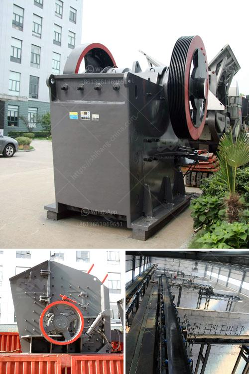

<h3>barite mining process with photos</h3>
Barite, a mineral composed of barium sulfate (BaSO4), is one of the most common weighting agents used in drilling fluids in the oil and gas industry. Its high specific gravity, low solubility, and softness make it an ideal mineral for many industrial applications. To meet the growing demand, barite mining operations have become more prevalent in various parts of the world. In this article, we will discuss the barite mining process and how it is extracted from the earth with the help of photos.

The barite mining process is straightforward. It begins with the extraction of ore from underground mines or by surface mining techniques. The mined ore is then washed, crushed, and ground to produce a fine powder for various end-use industries. The finely ground barite is then treated with chemicals, such as sodium carbonate, to remove impurities and improve its quality.

One of the commonly used methods for barite extraction is open-pit mining, which involves removing the surface layer of soil and rock to access the ore deposits underneath. This method is highly efficient and allows for the extraction of large quantities of barite. In the photos below, you can see the massive open-pit mines where barite is extracted.

Once the ore is extracted, it is transported to the processing plant for further treatment. The processing plant consists of various stages, including crushing, grinding, and flotation. In the crushing stage, the ore is crushed into smaller-sized particles using jaw crushers or cone crushers. This helps to reduce the size of the ore for easier handling and processing.

After crushing, the ore is ground into a fine powder using ball mills or vertical roller mills. The ground barite powder is then classified by particle size through screens and cyclones. The classified powder is stored in silos or bags for transportation to various industries.

In the final stage of the process, flotation is used to remove impurities from the barite powder and improve its quality. Flotation involves adding reagents to the finely ground barite powder, which selectively bind to the barite particles and float them to the surface. The impurities are left behind, resulting in a purified barite concentrate.

Once the barite concentrate is obtained, it is dried and packaged for shipment to customers. The dried barite powder is often transported in bulk by trucks, trains, or ships, depending on the distance to the end-use industries.

Barite mining and processing play a crucial role in various industries, including oil and gas, pharmaceuticals, paints and coatings, and construction. With growing demand, efficient mining and processing techniques are continuously evolving to ensure a steady supply of high-quality barite.

In conclusion, the barite mining process involves the extraction of ore from underground or surface mines, followed by crushing, grinding, flotation, and drying stages. The extracted barite concentrate is then transported to various industries for use in drilling fluids, pharmaceuticals, paints, and coatings. The mining process, as illustrated in the provided photos, showcases the vital steps involved in obtaining this important mineral.
<h3>Contact us</h3><ul><li><strong>Whatsapp:&nbsp;<a href="https://wa.me/8613661969651">+8613661969651</a></strong></li><li><a href="https://swt.shibang-china.com/?git&amp;zhl&amp;barite mining process with photos"><strong>Online Service(chat now)</strong></a></li></ul><h3>Related</h3><ul><li><a href='bauxite crushing machine in maharashtra.md'>bauxite crushing machine in maharashtra</a></li><li><a href='crusher plant in tarlac.md'>crusher plant in tarlac</a></li><li><a href='vertical grinder mill.md'>vertical grinder mill</a></li><li><a href='mica powder mill equipment supplier.md'>mica powder mill equipment supplier</a></li><li><a href='crusher manufacturers in turkey.md'>crusher manufacturers in turkey</a></li></ul>