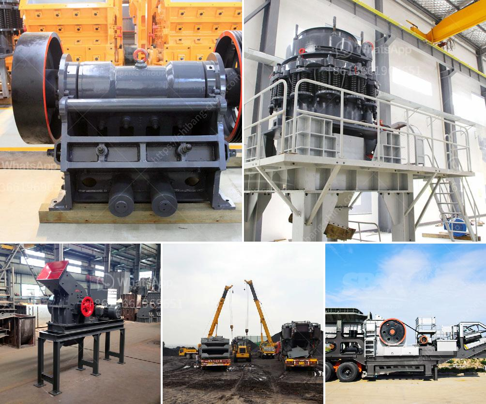

<h3>barite powder making</h3>
Barite, also known as barytes, is a naturally occurring mineral found in various parts of the world. Its chemical formula is BaSO4, which means it consists of barium sulfate. Barite has many industrial applications due to its high specific gravity, low solubility, and chemical inertness. One of the significant uses of barite is in the production of barite powder, which finds applications across a wide range of industries.

Barite powder is extensively used in the oil and gas drilling industry as a weighting agent. It helps to control the formation pressure and prevent blowouts during drilling operations. The high specific gravity of barite powder makes it an ideal choice for this purpose as it provides the necessary density required to balance the formation pressure. Additionally, its chemical inertness ensures that it does not react with other drilling fluids, making it a reliable additive in the oil and gas sector.

Another major application of barite powder is in the manufacturing of paints and coatings. Due to its high refractive index, barite powder enhances the opacity and brightness of the paint. It acts as an extender, reducing the consumption of more expensive pigments while improving the overall quality of the paint. Barite powder is also used in the production of radiation-shielding paints, which find applications in hospitals, laboratories, and other facilities where the control of radiation exposure is crucial.

In the construction industry, barite powder has several uses. It is widely employed as an aggregate in concrete, resulting in enhanced density and improved radiation shielding properties of the structures. Moreover, barite powder is utilized as a filler in concrete to reduce the porosity and increase the strength of the material. The addition of barite powder in concrete mixtures ensures the durability and stability of the constructed buildings.

Ceramic and glass industries also greatly benefit from the use of barite powder. Due to its high specific gravity and low heat expansion coefficient, barite powder is employed as a fluxing agent in the production of ceramics and glass. It helps achieve a uniform and stable melt during the firing process. Furthermore, barite powder is used as an additive in cement and brick manufacturing to enhance their strength and reduce cracking.

The process of making barite powder involves various stages. The mined barite rocks undergo crushing, grinding, and milling to obtain a fine powder of desired particle size. Several techniques, such as gravity separation, flotation, and magnetic separation, may be employed to enhance the purity of the powder. Once the barite powder is obtained, it is carefully packaged for storage and transportation.

In conclusion, barite powder has become an essential industrial mineral with its versatile applications in various sectors. From oil and gas drilling to construction, paints, ceramics, and glass, barite powder plays a vital role in enhancing the quality and performance of numerous products. Its unique characteristics, such as high specific gravity, low solubility, and chemical inertness, make it an ideal choice for industries requiring added density, opacity, and radiation shielding properties. The process of making barite powder involves several stages of crushing, grinding, and milling, ensuring the production of a fine powder suitable for specific applications.
<h3>Contact us</h3><ul><li><strong>Whatsapp:&nbsp;<a href="https://wa.me/8613661969651">+8613661969651</a></strong></li><li><a href="https://swt.shibang-china.com/?git&amp;zhl&amp;barite powder making"><strong>Online Service(chat now)</strong></a></li></ul><h3>Related</h3><ul><li><a href='stone crusher factory.md'>stone crusher factory</a></li><li><a href='mtw grinding mill.md'>mtw grinding mill</a></li><li><a href='mobile quarry crushing plant for sale in jamaica.md'>mobile quarry crushing plant for sale in jamaica</a></li><li><a href='used stone crusher in germany.md'>used stone crusher in germany</a></li><li><a href='crusher unit manufacturer india.md'>crusher unit manufacturer india</a></li></ul>