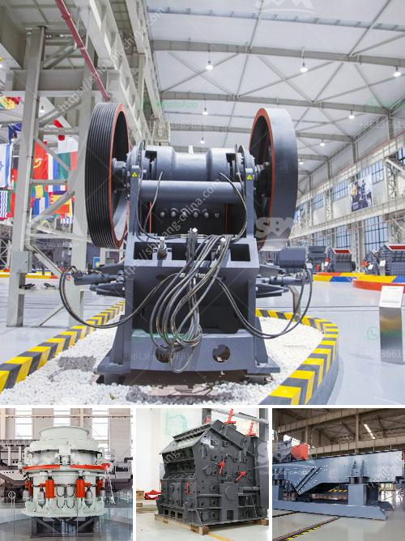

<h3>barite powder processing plant process flow diagram</h3>
Barite is a mineral composed of barium sulfate (BaSO4). It receives its name from the Greek word "barys" which means "heavy." This name is in response to barite's high specific gravity of 4.5, which is exceptional for a nonmetallic mineral. The high specific gravity of barite makes it suitable for a wide range of industrial applications, such as drilling muds and cementing operations.

In order to obtain high-quality barite powder, it is essential to carefully design a barite powder processing plant. A flow diagram of the plant is presented below:

The first step in the barite powder processing plant is crushing. In this process, jaw crusher and cone crusher are typically used as the primary and secondary crusher, respectively. Regarding the size of the raw material, different crushers are needed for crushing. For example, a jaw crusher is suitable for crushing big chunks of barite rocks, while a cone crusher is better for smaller particles.

After the initial crushing, the barite rocks are further ground down into a fine powder through the process of grinding. A ball mill or vertical roller mill (VRM) are used for this grinding process. Depending on the requirements of the application, different mills may be used to achieve the desired fineness of the barite powder.

Once the barite powder is ground to the desired fineness, it undergoes separation processes to remove impurities and obtain a pure product. The separation techniques commonly used are flotation, gravity separation, and electromagnetic separation.

In the flotation process, chemicals are added to the ground barite powder to make it float while leaving impurities behind. This allows for the separation of barite from other minerals.

Gravity separation is another commonly used method. It involves using the differences in specific gravity between barite and other minerals to separate them. This is achieved by passing the powdered mixture through a series of screens and shaking tables.

Electromagnetic separation is a more advanced technique used to separate barite from other minerals that have similar specific gravity. It utilizes the differences in magnetic properties of the minerals to effectively separate them.

Once the barite powder is separated, it undergoes a drying process to remove any remaining moisture. A rotary dryer is typically used for this purpose. After drying, the barite powder is ready for packaging.

The barite powder is then packed into bags or containers for shipment to customers. The packaging process ensures that the powder remains uncontaminated and protected during transportation.

In conclusion, the barite powder processing plant follows a systematic process flow diagram to produce high-quality barite powder. The plant includes crushing and grinding stages, followed by separation, drying, and packaging. With careful design and attention to detail, a well-functioning barite powder processing plant can deliver superior products to various industries.
<h3>Contact us</h3><ul><li><strong>Whatsapp:&nbsp;<a href="https://wa.me/8613661969651">+8613661969651</a></strong></li><li><a href="https://swt.shibang-china.com/?git&amp;zhl&amp;barite powder processing plant process flow diagram"><strong>Online Service(chat now)</strong></a></li></ul><h3>Related</h3><ul><li><a href='high energy ball milling process.md'>high energy ball milling process</a></li><li><a href='quartz powder making machine.md'>quartz powder making machine</a></li><li><a href='german crushing stone plant.md'>german crushing stone plant</a></li><li><a href='mica powder mill equipment supplier.md'>mica powder mill equipment supplier</a></li><li><a href='stone grinding plant.md'>stone grinding plant</a></li></ul>