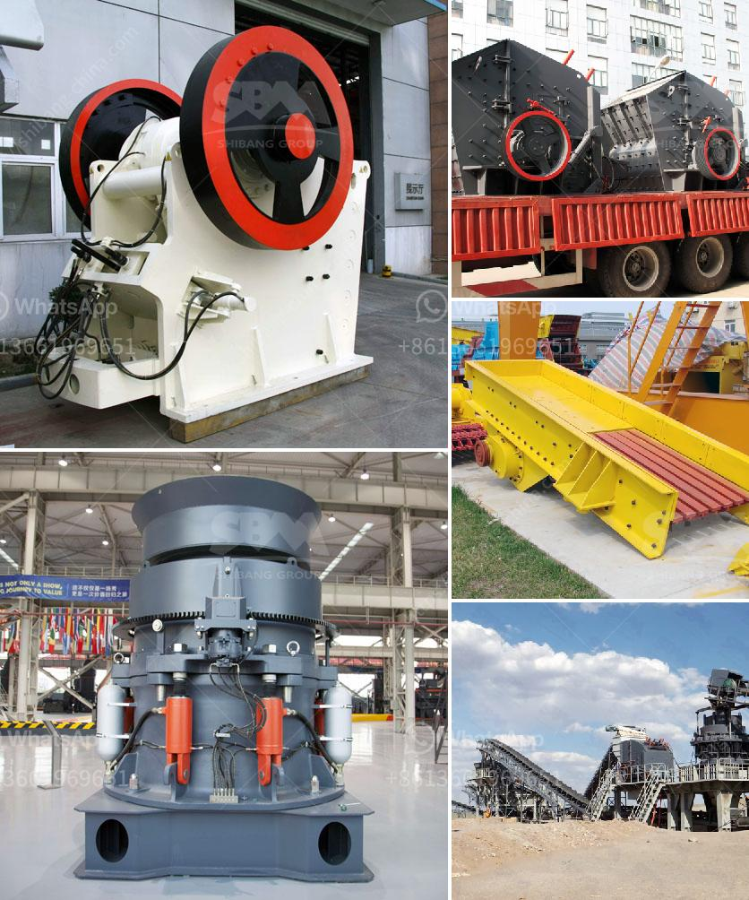

<h3>barite powder processing plant process</h3>
Barite is a mineral composed of barium sulfate (BaSO4). It is usually colorless or milky white, but can be almost any color depending on impurities trapped within the crystals during their formation. Barite comes from several locations around the world, including China, India, and the United States. It is primarily used in the oil and gas industry as a weighting agent in drilling fluids.

To process barite powder, it is undoubtedly crucial to use the right grinding equipment. The barite grinding plant is the necessary equipment in barite grinding under a range of circumstances, which can ensure the product quality and reduce energy consumption.

The grinding plant can also be used to manufacture other non-metallic minerals, such as calcite and limestone, according to specific applications. The barite powder processing plant uses high-pressure suspension grinding mill or Raymond mill as the grinding machine.

To reduce energy consumption and increase production efficiency, the powder concentrator can be used in the barite powder processing plant, which ensures the fineness of barite powder. Under the same production conditions, energy consumption of the concentrator is about 1/3 to 1/4 of the Raymond mill.

The main processing steps of the barite powder processing plant include crushing, screening, grinding, grading, and powder collection. It usually requires several stages of continuous operation to complete the full process.

Firstly, the barite ore is evenly fed into the jaw crusher by the vibrating feeder for primary crushing. Then, it is crushed by the jaw crusher into smaller pieces.

After that, the crushed barite is sent to the vibrating screen by the belt conveyor for screening. The oversized material is returned to the jaw crusher for further crushing, while the undersized material is sent to the storage bin by the bucket elevator.

Next, the barite powder is evenly sent to the grinding mill by the electromagnetic vibrating feeder for grinding. The ground barite powder is then classified by the powder concentrator, and the qualified powder is collected by the cyclone collector.

Finally, the collected barite powder is discharged through the powder discharging valve, and the finished product is transported to the storage bin by the pneumatic conveying system or other methods.

In conclusion, the process of barite powder processing plant involves crushing, screening, grinding, grading, and powder collection. The grinding plant plays a vital role in barite powder production, ensuring the quality and reducing energy consumption. With advanced grinding equipment and reliable process design, the barite powder processing plant can effectively meet the demands of the industry.
<h3>Contact us</h3><ul><li><strong>Whatsapp:&nbsp;<a href="https://wa.me/8613661969651">+8613661969651</a></strong></li><li><a href="https://swt.shibang-china.com/?git&amp;zhl&amp;barite powder processing plant process"><strong>Online Service(chat now)</strong></a></li></ul><h3>Related</h3><ul><li><a href='buy fine grinding machine.md'>buy fine grinding machine</a></li><li><a href='grinding mill installation operation.md'>grinding mill installation operation</a></li><li><a href='sizes of vertical shaft kilns.md'>sizes of vertical shaft kilns</a></li><li><a href='marble powder plant price pakistan.md'>marble powder plant price pakistan</a></li><li><a href='coconut shell powder making machine grinding mill for sale.md'>coconut shell powder making machine grinding mill for sale</a></li></ul>