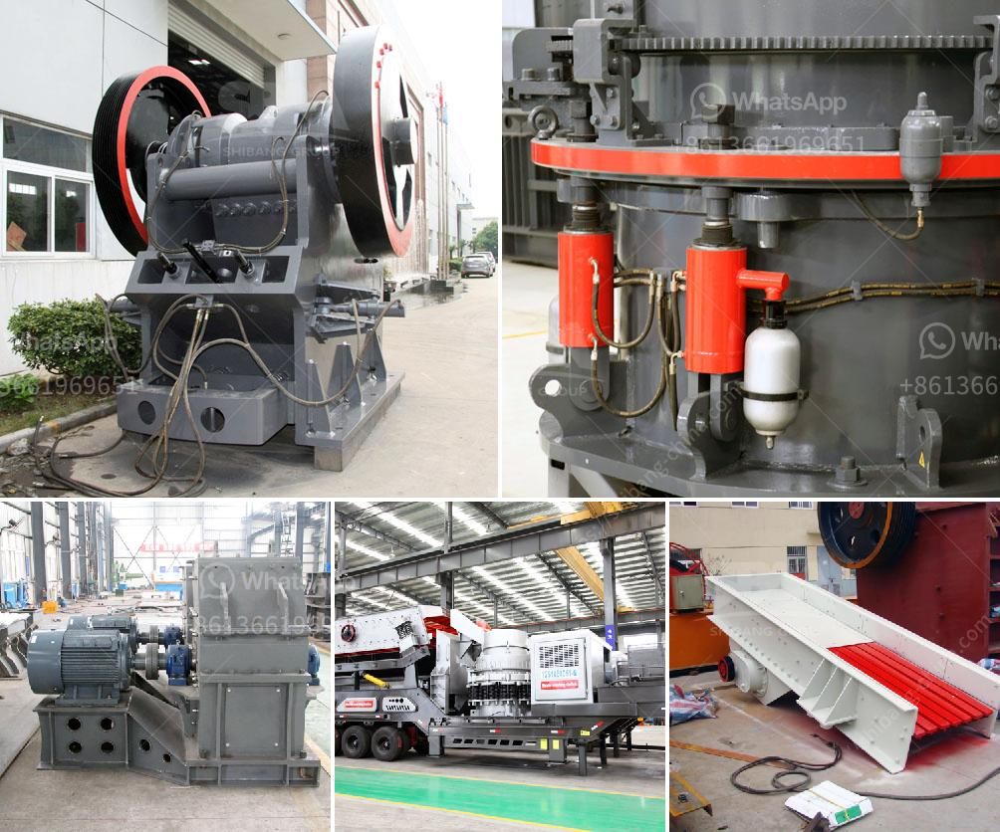

<h3>barite processing plants in texas</h3>
Barite is a mineral composed of barium sulfate (BaSO4). It is a common mineral found in various locations around the world, including Texas. In the state of Texas, barite deposits can be found in several counties, such as Brown, Coleman, and Brewster. These deposits have made Texas a major producer of barite, supplying much of the barite used in oil and gas drilling operations.

Barite is a crucial mineral in drilling operations because of its high specific gravity, which allows it to control the pressure within the wellbore. It is used to make drilling mud, a dense fluid that helps to cool the drill bit, remove rock cuttings, and maintain stability of the wellbore walls. Without barite, drilling operations would be much more challenging and less efficient.

To extract barite from the earth, it must be mined. Barite mining is typically done using open-pit methods, whereby the ore is extracted by removing overburden (soil and rock) that covers the minerals. This method is commonly used in Texas due to the nature of barite deposits in the state.

Once mined, the crude barite is transported to processing plants in Texas for further refining. Milling processes are used to crush and grind the crude barite rock into fine particles to aid in the subsequent separation process. Various techniques, such as gravity separation, flotation, and magnetic separation, are used to separate the barite from other minerals and impurities.

Texas is home to several barite processing plants, processing thousands of tons of crude barite each year. These plants produce various grades of powdered and granular barite for different applications. Some of the commonly used grades of barite include API-13A, which is used in oil and gas drilling, and paint grade barite, which is used in paints, coatings, and pigments.

Barite processing plants in Texas play a crucial role in supplying barite to domestic and international markets. As the demand for barite continues to rise, the importance of these plants in meeting the global demand cannot be overstated. These plants not only provide a valuable raw material but also contribute greatly to the economy of Texas.

In addition to its uses in drilling operations and the paint industry, barite has a wide range of applications. It is used as a filler in plastics, rubber, and concrete, as well as in the production of ceramics and glass. It is also used in medical imaging, where it is employed as a contrast agent in X-ray and CT scans.

Environmental considerations are an important aspect of barite processing. While barite mining and processing can have some environmental impact, regulations and best practices are in place to minimize any negative effects. Reclamation and restoration efforts are also undertaken to ensure re-establishment of natural habitats once barite extraction is complete.

In conclusion, barite processing plants in Texas play a significant role in supplying barite to various industries. These plants help meet the global demand for barite, used in drilling operations, paints, plastics, and various other applications. The economic and environmental importance of these plants cannot be overlooked as they contribute to the state's economy and ensure responsible resource management.
<h3>Contact us</h3><ul><li><strong>Whatsapp:&nbsp;<a href="https://wa.me/8613661969651">+8613661969651</a></strong></li><li><a href="https://swt.shibang-china.com/?git&amp;zhl&amp;barite processing plants in texas"><strong>Online Service(chat now)</strong></a></li></ul><h3>Related</h3><ul><li><a href='ball mill 3 ton.md'>ball mill 3 ton</a></li><li><a href='impact crushers for rent.md'>impact crushers for rent</a></li><li><a href='used mobile screens and crusher in africa.md'>used mobile screens and crusher in africa</a></li><li><a href='low cost jaw crusher price in uganda.md'>low cost jaw crusher price in uganda</a></li><li><a href='mica processing technology and flow chart.md'>mica processing technology and flow chart</a></li></ul>