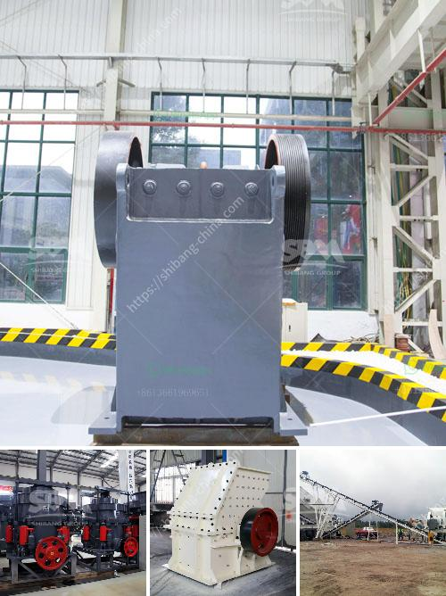

<h3>basalt rock quarry plant</h3>
When it comes to construction materials, there is none more useful than basalt rock. Ancient civilizations have recognized its strength and durability, using it for various purposes such as building temples, fortresses, and even roads. With advancements in technology and mining techniques, basalt rock quarry plants have become a crucial source of this valuable material.

A basalt rock quarry plant is a type of open-pit mine where basalt rock is extracted from the ground using various equipment. This includes drilling and blasting machinery to break down the rock and large loaders to transport the materials to a crushing plant. These plants crush and screen the basalt rock into different sizes, which are then used for construction purposes.

One of the main reasons why basalt rock is preferred over other types of rock for construction is its exceptional strength. Basalt is a volcanic rock that forms from the rapid cooling of lava. This natural process results in a rock that has incredible tensile strength and excellent resistance to weathering. These properties make it suitable for a wide range of applications, including building foundations, roads, and concrete structures.

The use of basalt rock in construction also contributes to sustainable building practices. Basalt is an abundant material that is found all around the world. This means that its extraction and processing have a significantly lower environmental impact compared to other construction materials like concrete or steel. Furthermore, basalt rock can be crushed and recycled, reducing the need for new mining operations in the long run.

In addition to its strength and sustainability, basalt rock is also highly versatile. It can be used in its raw form or processed into basalt fiber, which is a durable and lightweight material with excellent thermal and acoustic properties. Basalt fiber can be used in buildings for insulation, reinforcement, and even as a replacement for steel in certain applications. This makes it a valuable resource that can help reduce the carbon footprint of construction projects.

Establishing a basalt rock quarry plant requires careful planning and consideration. The location of the quarry should be chosen based on the proximity to construction sites and accessibility for transportation. It is also important to have the necessary permits and licenses to operate a quarry in compliance with environmental regulations.

To harness the full potential of a basalt rock quarry plant, effective management and efficient operations are key. This includes optimizing the extraction process, ensuring workplace safety, and maximizing the recovery of materials. Investing in advanced technology and equipment can further enhance productivity and minimize the environmental impact of the quarry.

In conclusion, a basalt rock quarry plant is a vital resource for the construction industry. Its strength, durability, and sustainability make it an ideal choice for various applications. By establishing and operating a quarry plant effectively, builders can access a reliable source of high-quality basalt rock, contributing to the development of sustainable and resilient infrastructure.
<h3>Contact us</h3><ul><li><strong>Whatsapp:&nbsp;<a href="https://wa.me/8613661969651">+8613661969651</a></strong></li><li><a href="https://swt.shibang-china.com/?git&amp;zhl&amp;basalt rock quarry plant"><strong>Online Service(chat now)</strong></a></li></ul><h3>Related</h3><ul><li><a href='brick making machine for sale in south africa.md'>brick making machine for sale in south africa</a></li><li><a href='quarry plant solutions.md'>quarry plant solutions</a></li><li><a href='jaw crusher machine cost.md'>jaw crusher machine cost</a></li><li><a href='small scall stone crushing machine.md'>small scall stone crushing machine</a></li><li><a href='project cost of 100 tpd opc cement plant.md'>project cost of 100 tpd opc cement plant</a></li></ul>