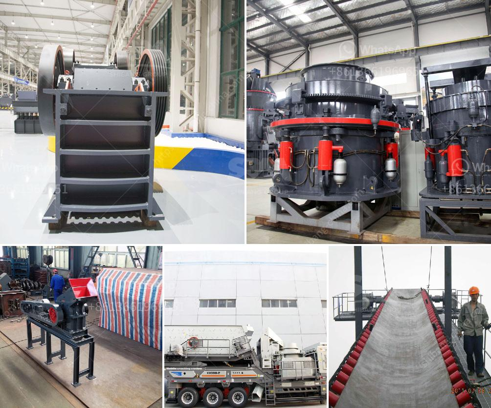

<h3>basalt stone processing plant</h3>
Basalt is a common igneous rock found in the Earth's crust. It is formed from the solidification of volcanic magma and is known for its durability and exceptional strength. Basalt stone has been used for various purposes throughout history, including construction, landscaping, and even as a decorative element in buildings. In recent years, the demand for basalt stone has increased significantly, leading to the establishment of basalt stone processing plants.

A basalt stone processing plant is a facility where the raw basalt stone is processed into various products by cutting, shaping, and polishing them. The plant can be divided into different sections including crushing, shaping, and grinding. Each section is dedicated to a specific process that transforms the basalt stone into its final product.

The first step in the processing plant is the crushing section. Here, large basalt stones are crushed into smaller pieces using heavy machinery. This step is essential to reduce the size of the stones and make them manageable for further processing. Crushers, such as jaw crushers and cone crushers, are commonly used in this section.

Once the basalt stones are crushed, they move on to the shaping section. Here, the stones are further processed to achieve the desired shape. Different cutting and shaping techniques are employed, depending on the intended use of the basalt stone. The stones can be cut into blocks, slabs, or tiles, depending on the requirements. In addition to cutting, various tools are used to shape the stones into different forms, such as columns, spheres, or decorative pieces.

After shaping, the basalt stones move on to the grinding section. In this section, the stones are polished to give them a smooth and attractive finish. Grinding machines equipped with abrasives are used to remove any rough edges and give the basalt stones a glossy appearance. The level of polish can be customized according to the customer's preference, ranging from matte to high-gloss.

Once the basalt stones have been polished, they are ready for shipment and use. Basalt stones have a wide range of applications, making them highly sought after in various industries. They are commonly used in construction projects, such as building facades, pavements, and countertops. Their durability and resistance to erosion make them suitable for outdoor use as well.

Basalt stone processing plants play a crucial role in meeting the growing demand for basalt stones. The plants utilize advanced machinery and techniques to transform raw basalt stone into high-quality finished products. With the increasing awareness about the durability and aesthetic appeal of basalt stones, the demand for these products is expected to rise further.
<h3>Contact us</h3><ul><li><strong>Whatsapp:&nbsp;<a href="https://wa.me/8613661969651">+8613661969651</a></strong></li><li><a href="https://swt.shibang-china.com/?git&amp;zhl&amp;basalt stone processing plant"><strong>Online Service(chat now)</strong></a></li></ul><h3>Related</h3><ul><li><a href='jaw crushers manufacturers europe.md'>jaw crushers manufacturers europe</a></li><li><a href='how much does coal mining machines costs.md'>how much does coal mining machines costs</a></li><li><a href='mobile roller crushers in south africa.md'>mobile roller crushers in south africa</a></li><li><a href='small scale tin mining design.md'>small scale tin mining design</a></li><li><a href='mobile vibrating screens.md'>mobile vibrating screens</a></li></ul>