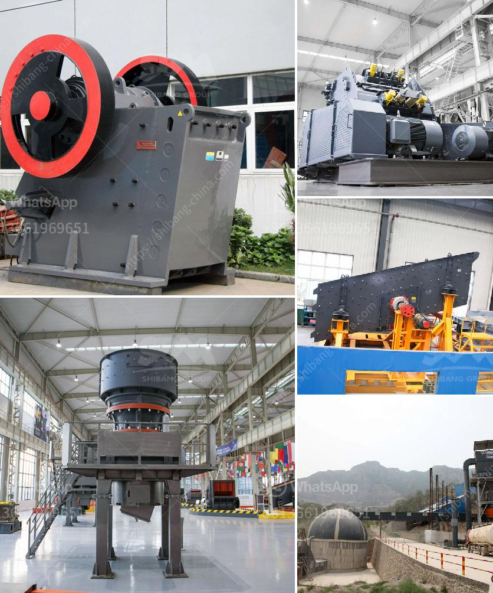

<h3>bauxite beneficiation process</h3>
Bauxite is the principal ore of aluminum and is a mixture of aluminum oxides and hydroxides that formed from intense chemical weathering of a soil in tropical environments. So, bauxite is a rock that is mainly composed of various minerals. Most importantly, bauxite is the primary ore for aluminum. Aluminum is a very crucial element as its uses are varied and diverse - such as in transportation, packaging, construction, power generation, and many more industries.

Bauxite is typically extracted through open-pit mining, which is a surface mining method where rocks or minerals are extracted from an open pit near the surface of the earth. The bauxite ore is then crushed and screened to remove impurities and create a high-grade, concentrated material called alumina. The alumina is further refined into aluminum through a smelting process. However, not all bauxite ores are readily usable for aluminum production, as they may contain high levels of impurities or have low alumina content.

To overcome these challenges, bauxite beneficiation is a crucial undertaking that aims to improve the concentration, purity, and quality of bauxite ore for further usage in the aluminum industry. The process involves crushing, screening, grinding, and washing the bauxite ore to remove impurities such as silica, iron oxides, and organic matter. The resulting beneficiated bauxite is a high-quality ore suitable for further processing.

The primary objective of bauxite beneficiation is to improve the alumina-to-silica ratio (AS ratio) of the ore. High AS ratios are desired as they reduce the consumption of caustic soda during the Bayer process, which is the primary method for extracting alumina from bauxite. The Bayer process involves dissolving the beneficiated bauxite in sodium hydroxide at high temperatures, followed by precipitation and calcination to obtain alumina.

Several methods are employed in bauxite beneficiation to enhance the AS ratio. One common method is scrubbing, which involves removing the finer particles of silica through attrition scrubbing. This process involves agitating the ore with water and chemicals in a rotating drum, which helps break down the impurities and wash them away. After scrubbing, the bauxite is screened to separate the clean material from the waste.

Another method used in bauxite beneficiation is gravity concentration. This technique relies on the difference in density between the bauxite minerals and gangue minerals. The crushed and screened bauxite ore is suspended in a medium, such as water or a solution of specific gravity, and subjected to a gravitational field. The heavier bauxite particles settle while the lighter impurities float, allowing for efficient separation.

In addition to scrubbing and gravity concentration, magnetic separation and flotation are also employed in bauxite beneficiation to further remove impurities. Magnetic separation uses magnets to attract and separate magnetic minerals, while flotation relies on chemical agents to selectively attach to the desired minerals, making them float while leaving the impurities behind.

Overall, bauxite beneficiation is a crucial process that aims to improve the quality of bauxite ore for efficient aluminum production. Through various techniques such as scrubbing, gravity concentration, magnetic separation, and flotation, impurities in the ore can be effectively removed, resulting in bauxite ore with a higher alumina-to-silica ratio. This beneficiated bauxite is then ready for the Bayer process, where alumina extraction takes place, contributing to the overall production of aluminum, an essential element in various industries.
<h3>Contact us</h3><ul><li><strong>Whatsapp:&nbsp;<a href="https://wa.me/8613661969651">+8613661969651</a></strong></li><li><a href="https://swt.shibang-china.com/?git&amp;zhl&amp;bauxite beneficiation process"><strong>Online Service(chat now)</strong></a></li></ul><h3>Related</h3><ul><li><a href='gold mining equipment companies in china.md'>gold mining equipment companies in china</a></li><li><a href='stone crusher machine china.md'>stone crusher machine china</a></li><li><a href='small scale gold mill from china.md'>small scale gold mill from china</a></li><li><a href='used gold stamp mill for sale in south africa.md'>used gold stamp mill for sale in south africa</a></li><li><a href='hammer mill in china.md'>hammer mill in china</a></li></ul>