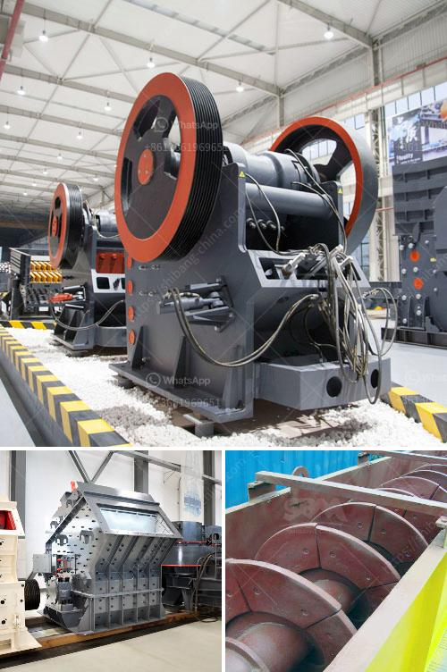

<h3>bauxite crushing machine in maharashtra</h3>
Bauxite is a mineral found mostly in a belt around the equator. Bauxite, containing about 20-25 percent aluminum, is the only ore that is used for commercial extraction of aluminum today. In the crushing process of bauxite, the jaw crusher is commonly used as the primary crushing machine. In Maharashtra, bauxite is used to manufacture aluminium.

Bauxite is the most important ore of aluminum which contains only 30–54% alumina, Al2O3; the rest is a mixture of silica, various iron oxides, and titanium dioxide along with trace amounts of zinc, phosphorous, nickel, vanadium, etc., as indicated earlier. The various impacts of bauxite mining activities on environmental components are discussed briefly below:

1. Land: The major impacts of bauxite extraction on land are deforestation, removal of topsoil, and improper waste disposal. These activities can lead to habitat destruction, loss of biodiversity, and soil erosion.

2. Water Bodies: Bauxite mining activities can pollute water bodies through the discharge of effluents containing chemicals, such as heavy metals. These chemicals can contaminate surface water and groundwater, posing a risk to human health and aquatic ecosystems.

3. Air Quality: The dust and emissions generated during the mining and crushing process of bauxite can contribute to air pollution. The fine particles suspended in the air can cause respiratory problems and other health issues for nearby communities.

Given these environmental concerns, the bauxite crushing machine in Maharashtra plays a vital role in the mining process. To ensure sustainable extraction of this mineral resource, it is crucial to optimize the crushing process through proper maintenance of the machinery.

The crushing stage involves different types of crusher machines that have different functions. Jaw crusher is mainly used for primary crushing of the raw ore because of its large crushing ratio, simple structure, and reliable performance. Cone crusher and impact crusher are secondary crushing equipment commonly used in the mining crushing process. The two-stage and three-stage crushing is usually performed in two or three stages based on the requirements of the industrial applications.

Conveyor transport plays a vital role in the efficiency and productivity of the bauxite crushing machine. The conveyor belt evenly feeds the material into the crusher, ensuring continuous operation. Belt conveyors can be customized to meet specific crushing plant requirements, making them suitable for all types of applications in the mining industry.

Proper maintenance of the bauxite crushing machine is essential to ensure its efficient operation. Regular inspection and monitoring of the equipment help to identify potential problems before they cause substantial damage or downtime. Lubricating the moving parts, conducting routine maintenance checks, and ensuring proper alignment of the machine can extend its lifespan and optimize its performance.

While bauxite crushing is an essential step in the aluminum production chain, the environmental impacts should not be overlooked. It is crucial for mining companies in Maharashtra to implement sustainable practices and technologies to minimize their environmental footprint. This can involve utilizing renewable energy sources, adopting efficient waste management strategies, and investing in research and development of greener technologies.

By prioritizing environmental sustainability in bauxite crushing operations, Maharashtra can ensure responsible and sustainable extraction of this valuable mineral resource. With proper maintenance and equipment optimization, the crushing process can be done efficiently and mitigate the environmental impacts associated with bauxite mining.
<h3>Contact us</h3><ul><li><strong>Whatsapp:&nbsp;<a href="https://wa.me/8613661969651">+8613661969651</a></strong></li><li><a href="https://swt.shibang-china.com/?git&amp;zhl&amp;bauxite crushing machine in maharashtra"><strong>Online Service(chat now)</strong></a></li></ul><h3>Related</h3><ul><li><a href='china limestone jaw crusher machine.md'>china limestone jaw crusher machine</a></li><li><a href='brick making machine for sale in south africa.md'>brick making machine for sale in south africa</a></li><li><a href='bentonite grinding mill in italy crusher.md'>bentonite grinding mill in italy crusher</a></li><li><a href='stone quarries crusher in uganda.md'>stone quarries crusher in uganda</a></li><li><a href='concrete crushing machines in kenya.md'>concrete crushing machines in kenya</a></li></ul>