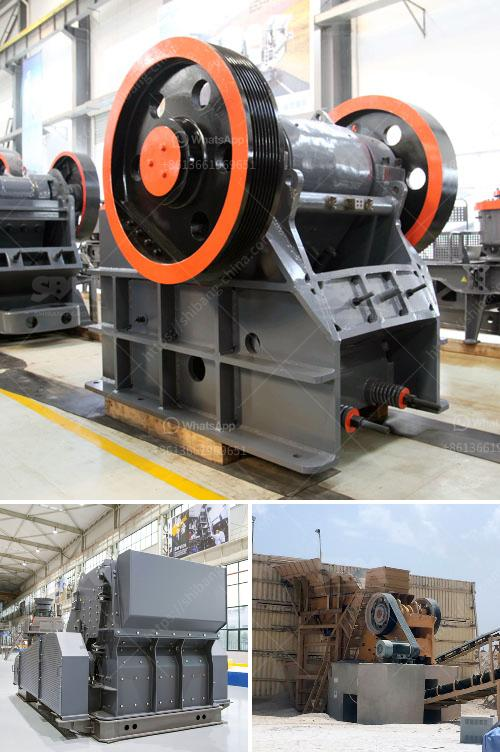

<h3>belt conveyor calculation sheet</h3>
Belt Conveyors are an essential part of many manufacturing and processing operations. They are widely used in industries like mining, agriculture, food processing, pharmaceuticals, and more. Belt Conveyors offer an efficient and reliable method of transporting goods and materials from one point to another.

One of the key aspects of designing a Belt Conveyor system is the calculation of the Belt Conveyor capacity. This calculation sheet helps in determining the maximum capacity of the Belt Conveyor system. It takes into account various factors like belt speed, width, length, inclination angle, load capacity, and material properties.

The first step in calculating the Belt Conveyor capacity is to determine the belt speed. This is the speed at which the belt moves and is usually expressed in meters per second. The belt speed is determined by the material flow rate and the conveyor's effective width. Once the belt speed is known, the next step is to calculate the Belt Conveyor's capacity in terms of the material flow rate. This is the amount of material that can be transported in a specific time period and is usually expressed in tons per hour or cubic meters per hour.

The material flow rate is influenced by the belt width and the belt length. The belt width is the distance between the outer edges of the conveyor belt and is determined based on the material being transported and the conveyor's design. The belt length is the actual length of the conveyor belt and is usually determined by the distance between the conveyor's head and tail pulleys.

In addition to the belt speed, width, and length, the calculation sheet also considers the inclination angle of the conveyor. The inclination angle is the angle at which the conveyor is inclined from the horizontal and is an important factor in calculating the Belt Conveyor's capacity. It affects the material flow rate, as well as the power requirements of the conveyor system.

Another critical factor in the calculation sheet is the load capacity of the conveyor. This is the maximum weight that the conveyor system can handle and is influenced by the material being transported, the conveyor's design, and the safety factor assigned to the conveyor. The load capacity determines the size and strength of the conveyor components like the belts, pulleys, and rollers.

Lastly, the calculation sheet takes into account the material properties like density, angle of repose, and coefficient of friction. These properties affect the material flow rate and the power requirements of the conveyor system. They are essential in determining the Belt Conveyor's capacity accurately.

In conclusion, the Belt Conveyor calculation sheet is a crucial tool in designing an efficient and reliable conveyor system. It considers various factors like belt speed, width, length, inclination angle, load capacity, and material properties to calculate the maximum capacity of the conveyor system. With this information, manufacturers and engineers can design Belt Conveyors that meet their specific requirements and ensure smooth material handling operations.
<h3>Contact us</h3><ul><li><strong>Whatsapp:&nbsp;<a href="https://wa.me/8613661969651">+8613661969651</a></strong></li><li><a href="https://swt.shibang-china.com/?git&amp;zhl&amp;belt conveyor calculation sheet"><strong>Online Service(chat now)</strong></a></li></ul><h3>Related</h3><ul><li><a href='stone crusher price in india.md'>stone crusher price in india</a></li><li><a href='on sale used quarry machinery uk.md'>on sale used quarry machinery uk</a></li><li><a href='crush calcite equipment.md'>crush calcite equipment</a></li><li><a href='stone crusher importer in ethiopia.md'>stone crusher importer in ethiopia</a></li><li><a href='double rollar mill.md'>double rollar mill</a></li></ul>