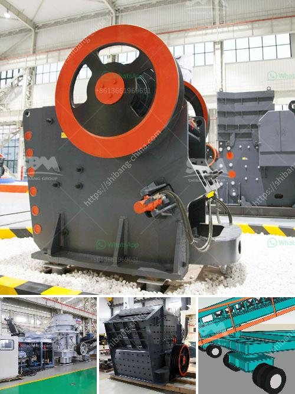

<h3>belt conveyor europe</h3>
In today's fast-paced world, where industries are constantly striving for efficiency, belt conveyors have emerged as the backbone of material handling systems in Europe. These ingenious machines provide a seamless and automated solution for transporting goods, offering numerous benefits to industries across the continent.

One of the key advantages of belt conveyors is their ability to transport large volumes of goods quickly. By using a continuous belt loop, these conveyors can move products efficiently, reducing manual labor and improving productivity. They can handle a wide range of materials, from small items like parcels and packages to heavier loads such as machinery parts or bulk items, making them versatile for various industries.

The design of belt conveyors is highly customizable, allowing them to fit seamlessly into any manufacturing or production line. With adjustable speed, incline, and decline angles, these conveyors can be tailored to suit specific operational requirements. Additionally, their modular structure enables easy installation, expansion, and relocation, ensuring maximum flexibility and adaptability.

Safety is a top priority in any workplace, and belt conveyors excel in this aspect. With proper guarding, emergency stop buttons, and safety sensors, the risk of accidents or injuries is significantly reduced. Moreover, the automated nature of belt conveyors eliminates the need for manual handling, minimizing the strain on workers' bodies and reducing the likelihood of musculoskeletal disorders.

In terms of sustainability, belt conveyors are a preferred choice. They are energy-efficient machines that consume minimal power compared to alternative modes of material transportation. By automating the movement of goods, these conveyors optimize energy consumption, contributing to reduced carbon emissions. Furthermore, they are created using recyclable materials, making them environmentally friendly and aligning with the principles of a circular economy.

The European market has witnessed a growing demand for belt conveyors in various sectors. In the e-commerce industry, for instance, these conveyors play a crucial role in streamlining order fulfillment and ensuring speedy delivery. They seamlessly integrate with sorting systems, allowing products to be efficiently sorted based on size, weight, or destination.

The manufacturing sector also relies heavily on belt conveyors for efficient and cost-effective production. These conveyors transport raw materials to different processing stations, ensuring a smooth production flow. They can be used in assembly lines, enabling products to move smoothly between different stages of production, reducing bottlenecks, and increasing overall throughput.

The food and beverage industry is another sector where belt conveyors are extensively utilized. They facilitate the movement of products without compromising hygiene, thanks to their easy-to-clean design and material options that comply with food safety regulations. Belt conveyors are used for tasks like ingredient handling, product packaging, and product inspection, ensuring food safety and quality throughout the supply chain.

In conclusion, belt conveyors have become the backbone of efficient material handling systems in Europe. Their ability to transport large volumes of goods quickly, their customizable design, and their focus on safety make them highly sought-after in various industries. Moreover, their sustainability aspect, energy efficiency, and contribution to reducing carbon emissions align with Europe's commitment to environmental responsibility. With their versatility and ability to optimize production processes, belt conveyors continue to revolutionize the way industries operate, representing an essential investment for businesses looking to streamline their material handling operations.
<h3>Contact us</h3><ul><li><strong>Whatsapp:&nbsp;<a href="https://wa.me/8613661969651">+8613661969651</a></strong></li><li><a href="https://swt.shibang-china.com/?git&amp;zhl&amp;belt conveyor europe"><strong>Online Service(chat now)</strong></a></li></ul><h3>Related</h3><ul><li><a href='large capacity ton per hour limestone crushers.md'>large capacity ton per hour limestone crushers</a></li><li><a href='roll crusher reduction ratio.md'>roll crusher reduction ratio</a></li><li><a href='top mobile crusher.md'>top mobile crusher</a></li><li><a href='crusehr equipment ball mill.md'>crusehr equipment ball mill</a></li><li><a href='aggregate screens for sale.md'>aggregate screens for sale</a></li></ul>