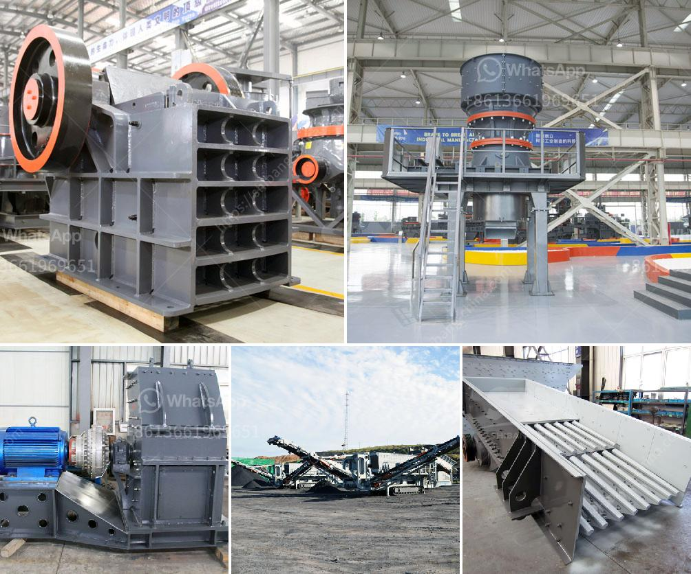

<h3>bentonite grinding mill in italy crusher</h3>
Bentonite, also known as montmorillonite, is a naturally occurring clay mineral found in abundance in many different regions of the world including Italy. This mineral has been used for centuries as a natural remedy for various ailments and is also widely used in industries such as agriculture, cosmetics, pharmaceuticals, and more.

With the increasing demand for bentonite products, the need for efficient grinding and processing equipment has become crucial. Italy, known for its rich history and expertise in art and engineering, has emerged as one of the leading manufacturers of bentonite grinding mills.

Bentonite grinding mills are designed to process various non-explosive and non-flammable minerals with Mohs hardness below 9 and humidity less than 6%, such as bentonite, limestone, calcite, barite, dolomite, potassium feldspar, marble, talcum, gypsum, kaolin, bentonite, diatomite, graphite, alunite, fluorite, potassium feldspar, phosphorite, pigment, and so on.

One of the key components in a bentonite grinding mill is the grinding roller. This component provides the grinding force that enables the material to be pulverized. The grinding roller is made of high-quality materials that are wear-resistant, heat-resistant, and durable. It is also designed with a unique shape and structure to enhance efficiency and minimize energy consumption.

In addition to the grinding roller, a bentonite grinding mill also consists of a grinding ring, blade, air classifier, hot air duct, bag dust collector, and electrical control system. These components work together in a synchronized manner to achieve optimal grinding and processing results.

The efficiency and performance of a bentonite grinding mill in Italy are further enhanced by advanced technology. Italian manufacturers are constantly innovating and improving their grinding mill designs to provide customers with state-of-the-art equipment. With features such as high precision, automatic control, stable performance, and low energy consumption, these mills are able to produce finely ground and highly homogeneous bentonite powders.

The applications of bentonite powders are vast and varied. In the agricultural industry, bentonite powders are used as soil additives to improve fertility, water holding capacity, and nutrient availability. In the cosmetic industry, bentonite powders are used in skincare products like face masks and exfoliators to remove impurities and detoxify the skin. In the pharmaceutical industry, bentonite powders are used in medicines and supplements for their binding and lubricating properties.

In conclusion, the bentonite grinding mill in Italy plays a crucial role in the processing and utilization of bentonite minerals. With advanced grinding technology, high-quality materials, and innovative design, Italian manufacturers are able to provide efficient and reliable grinding mills for various industries. Whether it is for agricultural, cosmetic, or pharmaceutical applications, bentonite grinding mills from Italy are sure to meet the demanding requirements of customers worldwide.

- "Bentonite Grinding Mill" (https://www.grindingmill.in/news/industry-news/bentonite-grinding-mill.html)

- "Efficient Grinding Mill for Bentonite" (https://www.impact-mill.com/news/industry-news/efficient-grinding-mill-for-bentonite.html)

- "Bentonite Roller Grinding Mill" (https://www.ultra-mill.com/news/industry-news/bentonite-roller-grinding-mill.html)
<h3>Contact us</h3><ul><li><strong>Whatsapp:&nbsp;<a href="https://wa.me/8613661969651">+8613661969651</a></strong></li><li><a href="https://swt.shibang-china.com/?git&amp;zhl&amp;bentonite grinding mill in italy crusher"><strong>Online Service(chat now)</strong></a></li></ul><h3>Related</h3><ul><li><a href='quartz crushing grinding mill.md'>quartz crushing grinding mill</a></li><li><a href='used pioneer jaw crusher.md'>used pioneer jaw crusher</a></li><li><a href='cost of 150tph cement grinding plant.md'>cost of 150tph cement grinding plant</a></li><li><a href='graphite powder processing equipment.md'>graphite powder processing equipment</a></li><li><a href='barite bulking process.md'>barite bulking process</a></li></ul>