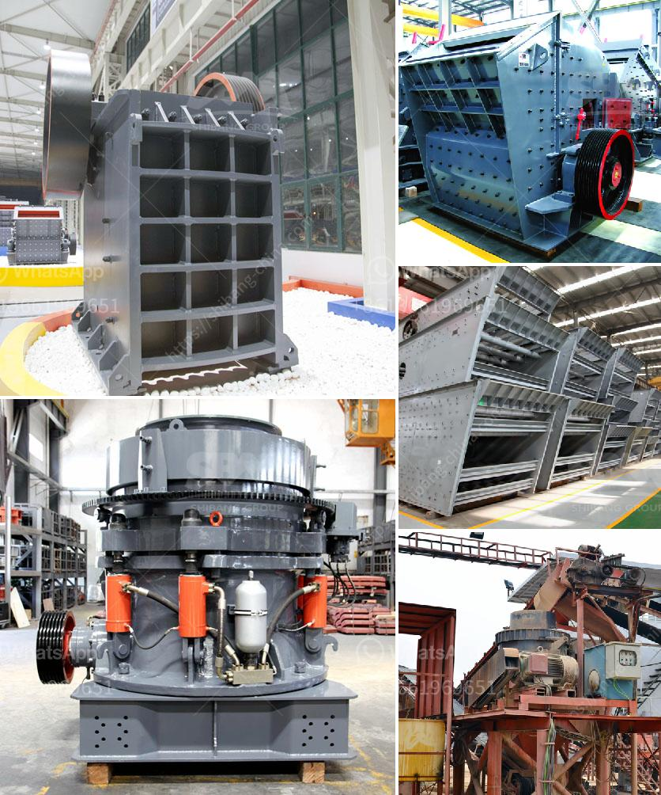

<h3>bentonite powder mill manufacturers</h3>
Bentonite is a very common and widely used material in various industrial applications such as drilling fluids, binder, purifier, wastewater treatment, and many other uses. It is a naturally occurring clay mineral that has high water absorption and swelling properties. To process this mineral into powder form, bentonite powder mills are required. In this article, we will be discussing some of the leading bentonite powder mill manufacturers.

When it comes to the utilization of bentonite powder, the milling process is essential. Different manufacturers produce different equipment, ensuring the production of high-quality bentonite powder. In recent years, there has been a rise in demand for bentonite powder mills due to its increasing applications. This has led to the emergence of various bentonite powder mill manufacturers in the market.

One of the well-recognized manufacturers is Clirik Machinery. They have been in the industry for several years and have gained a good reputation for producing efficient and reliable machinery. Clirik Machinery offers a wide range of bentonite powder mills, including Raymond mills, vertical mills, ultra-fine mills, and other equipment. Their mills are designed to process different types of bentonite, ensuring the production of high-quality powder.

Another leading manufacturer in the industry is Guilin Hongcheng Mining Equipment Manufacture Co., Ltd. They have extensive experience in manufacturing grinding mills and provide a variety of bentonite powder mill options. Their mills are known for their advanced technology and high grinding efficiency. With a strong R&D team, Guilin Hongcheng continuously improves their equipment to meet the changing needs of the market.

Limestone grinding mill manufacturer, Shanghai Clirik Machinery Co., Ltd, also produces bentonite grinding mills. Their mills are designed to process bentonite with high efficiency and low energy consumption. The company's grinding mills are widely used in the mining industry, chemical industry, construction industry, and other sectors.

Additionally, Vipeak Heavy Industry Machinery, Henan Liming Heavy Industry Science & Technology Co., Ltd, and Shanghai Shibang Machinery Co., Ltd are also reputable manufacturers of bentonite powder mills. These companies offer a wide range of milling equipment with different specifications to meet the diverse requirements of customers.

In conclusion, there are several well-established and reputable manufacturers of bentonite powder mills. These manufacturers provide efficient and reliable equipment, ensuring the production of high-quality bentonite powder. When selecting a manufacturer, it is crucial to consider factors such as product quality, grinding efficiency, and after-sales services. By choosing a reliable manufacturer, industries can enhance their production processes and achieve better outputs using bentonite powder.
<h3>Contact us</h3><ul><li><strong>Whatsapp:&nbsp;<a href="https://wa.me/8613661969651">+8613661969651</a></strong></li><li><a href="https://swt.shibang-china.com/?git&amp;zhl&amp;bentonite powder mill manufacturers"><strong>Online Service(chat now)</strong></a></li></ul><h3>Related</h3><ul><li><a href='raymond mill roll asembley.md'>raymond mill roll asembley</a></li><li><a href='stone crusher mobile plant di indonesia.md'>stone crusher mobile plant di indonesia</a></li><li><a href='manufacturer of quartz powder in karnataka.md'>manufacturer of quartz powder in karnataka</a></li><li><a href='iron ore mobile crusher available in india.md'>iron ore mobile crusher available in india</a></li><li><a href='sand making machine roller mill.md'>sand making machine roller mill</a></li></ul>