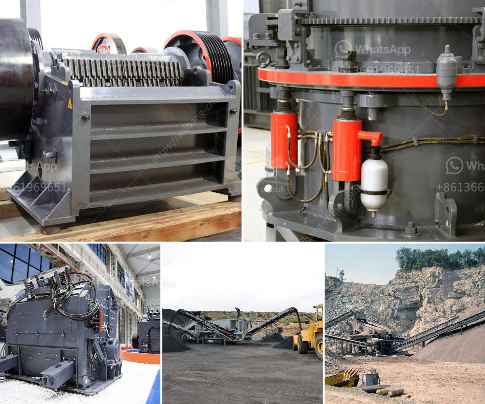

<h3>bentonite processing unit</h3>
Bentonite is a versatile clay mineral that has been widely used for various industrial applications. It is formed from volcanic ash and consists mainly of montmorillonite, a hydrous aluminum silicate. Bentonite has unique properties that make it highly valuable in several industries, including construction, drilling, foundry, and agriculture.

To cater to the growing demand for bentonite, processing units have been established. These units are equipped with state-of-the-art machinery and technology to efficiently process and refine bentonite into various forms suitable for different applications.

The processing unit starts with the mining of bentonite from deposits found in different parts of the world. The mined bentonite is then transported to the processing unit, where it undergoes several stages of processing.

The first step in the processing unit involves the removal of overburden and other impurities. This is done through a series of mechanical and chemical processes, including crushing, grinding, and screening. The goal is to achieve the desired particle size and remove any contaminants that might affect the quality of the final product.

After the initial processing, the bentonite is further refined to improve its properties. This includes removing excess moisture and reducing the presence of impurities such as quartz and feldspar. Several methods can be employed for this purpose, including centrifugation, filtration, and drying.

Once the bentonite is adequately processed and refined, it can be converted into various forms to suit different applications. For example, in the construction industry, bentonite can be transformed into a powdered form for soil stabilization, waterproofing, and to enhance the properties of cement and concrete. In drilling applications, bentonite can be processed into drilling muds and fluids that help lubricate and cool down drilling equipment.

The processing unit also ensures that the final bentonite product meets the required quality standards. This involves conducting rigorous quality control tests to assess factors such as particle size distribution, moisture content, viscosity, and pH level. By adhering to these strict quality control measures, the processing unit can consistently deliver high-quality bentonite that meets the specific needs of its customers.

In conclusion, bentonite processing units play a crucial role in the production of high-quality bentonite for various industrial applications. Through a series of mechanical and chemical processes, bentonite is refined and transformed into forms suitable for different industries such as construction and drilling. These processing units not only ensure the removal of impurities but also maintain stringent quality control measures to deliver consistent and reliable bentonite products. With the increasing demand for bentonite in various industries, these processing units are vital for meeting the market requirements and supporting the growth of the global bentonite industry.
<h3>Contact us</h3><ul><li><strong>Whatsapp:&nbsp;<a href="https://wa.me/8613661969651">+8613661969651</a></strong></li><li><a href="https://swt.shibang-china.com/?git&amp;zhl&amp;bentonite processing unit"><strong>Online Service(chat now)</strong></a></li></ul><h3>Related</h3><ul><li><a href='model project of stone powder.md'>model project of stone powder</a></li><li><a href='ball mill battery lead pdf.md'>ball mill battery lead pdf</a></li><li><a href='mobile sand washing machine.md'>mobile sand washing machine</a></li><li><a href='manufacturer of jaw crusher.md'>manufacturer of jaw crusher</a></li><li><a href='gypsum calcination processing plant equipments.md'>gypsum calcination processing plant equipments</a></li></ul>