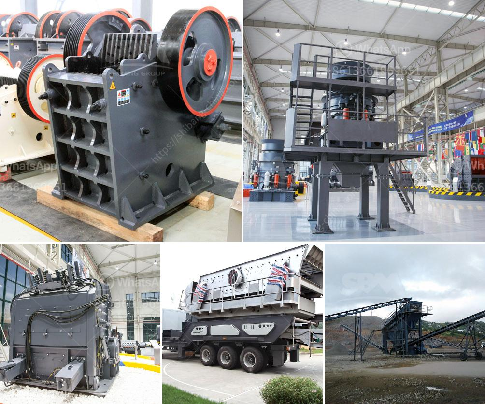

<h3>best cone crusher</h3>
The cone crusher is a crushing machine that has been widely used in various industries for many years, and it is often used in primary and secondary crushing applications. In the cone crusher, the crushing cavity is formed by the concave and mantle, and the concave is the main part of the crusher.

As the name suggests, a cone crusher has a conical-shaped crushing head that works to compress material against the inside surface of the concave. The material is crushed by the eccentric motion of the mantle and the concave.

There are many types of cone crushers available in the market, each with different features and capabilities. However, one of the best cone crushers available in the market is the Nordberg HP series cone crusher. This crusher has a unique combination of crusher speed, throw, crushing forces, and cavity design.

One of the key features of the Nordberg HP series cone crusher is the combination of higher horsepower, larger crushing stroke, and increased crushing cavity dimensions, which provides a higher output capacity and higher reduction ratio. This means that the crusher can handle larger feed sizes and produce more crushed product, making it suitable for a wide range of applications.

Another important feature of the Nordberg HP series cone crusher is the use of a tramp release system. This system allows for the easy passage of non-crushable material, preventing damage to the crusher and reducing downtime. The tramp release system automatically resets the crusher to its original setting after the tramp material has passed through.

The Nordberg HP series cone crusher is also known for its high performance, reliability, and durability. It has a robust construction, which ensures a long service life and reduced maintenance requirements. The crusher is also equipped with advanced automation features, such as automatic setting adjustment, tramp release, and cavity clearing, which make operation and maintenance easier.

In conclusion, the Nordberg HP series cone crusher is one of the best cone crushers available in the market. It offers a combination of higher horsepower, larger crushing stroke, and increased crushing cavity dimensions, which provide a higher output capacity and higher reduction ratio. The crusher also features a tramp release system, robust construction, and advanced automation features, making it a reliable and durable choice for various crushing applications. Whether it is used in mining, construction, or recycling, the Nordberg HP series cone crusher is an excellent option for any crushing needs.
<h3>Contact us</h3><ul><li><strong>Whatsapp:&nbsp;<a href="https://wa.me/8613661969651">+8613661969651</a></strong></li><li><a href="https://swt.shibang-china.com/?git&amp;zhl&amp;best cone crusher"><strong>Online Service(chat now)</strong></a></li></ul><h3>Related</h3><ul><li><a href='vertical grinder mill.md'>vertical grinder mill</a></li><li><a href='stone crusher sand block maker.md'>stone crusher sand block maker</a></li><li><a href='jual grinding roll mill.md'>jual grinding roll mill</a></li><li><a href='crusher plant in tarlac.md'>crusher plant in tarlac</a></li><li><a href='cost of setting up a cement plant in usa.md'>cost of setting up a cement plant in usa</a></li></ul>